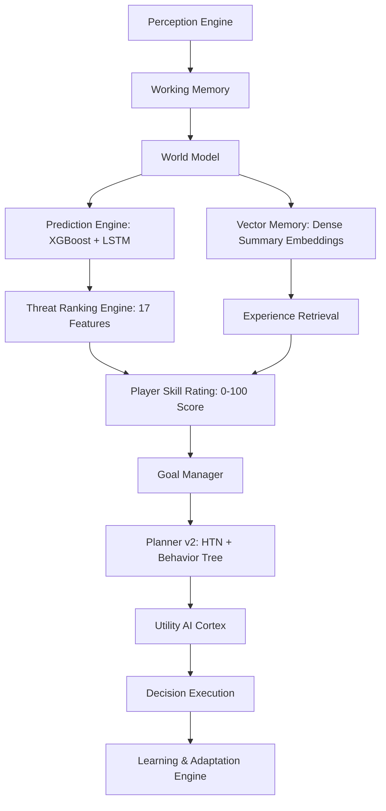

# MIRAI v2 — System Architecture Specification

## 1. Purpose & Core Vision
MIRAI is an autonomous, explainable AI engine designed for real-time video game boss combat and adaptive non-player characters (NPCs). It integrates sensing, multi-tiered memory, XGBoost & LSTM sequence prediction, threat ranking, player skill estimation, HTN & Behavior Tree planning, and Explainable AI (XAI) reasoning traces.

---

## 2. End-to-End System Pipeline



---

## 3. Core Subsystem Architecture

| Subsystem | Responsibilities | Key Class / Interface |
| :--- | :--- | :--- |
| **Sensing & Perception** | Entity tracking, spatial metrics, frame buffer | `PerceptionManager`, `SensoryCollector` |
| **Working Memory** | Short-term state, attention decay, focus item | `WorkingMemoryManager`, `AttentionFocus` |
| **Episodic Memory** | Combat match log storage & episode builder | `EpisodicMemoryManager`, `EpisodeStorage` |
| **Semantic Memory** | Knowledge graphs, rule pattern extraction | `SemanticMemoryManager`, `KnowledgeGraph` |
| **Vector Memory** | Dense spatial embeddings & FAISS top-K retrieval | `VectorStore`, `SimilaritySearchEngine` |
| **Prediction Engine** | XGBoost intent prediction + LSTM sequence fusion | `PredictionFusionEngine`, `LSTMTemporalModel` |
| **Threat Ranking** | 17-feature XGBoost Threat Ranker | `ThreatRanker`, `XGBoostThreatModel` |
| **Skill Rating** | 0-100 player skill score & strategy adaptation | `SkillModel`, `BayesianSkillRating` |
| **Planner v2** | HTN task networks + Behavior Tree execution | `HTNPlanner`, `SequenceBTNode`, `Blackboard` |
| **Explainability (XAI)** | Multi-subsystem reasoning trace explanation cards | `ExplanationEngine`, `ReasoningTrace` |

---

## 4. API & Quickstart Code Example

```python
from sdk.python.mirai_sdk import MiraiSDK

# 1. Initialize MIRAI Engine Session
runtime = MiraiSDK(session_id="boss_fight_01")

# 2. 3-Step Runtime Loop
runtime.observe({"timestamp": 12.0, "metadata": {"player_hp": 34.0}})
chosen_action = runtime.tick()
print(f"Chosen Action: {chosen_action}")

runtime.learn({"outcome": "VICTORY", "damage_dealt": 95.0})
```
