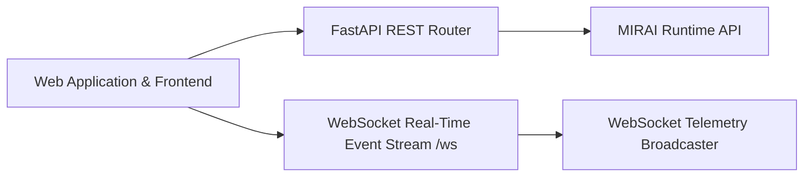

# MIRAI v2 — Backend APIs & WebSocket Specification

> **Phase 0 Specification & Deliverable Documentation**  
> "Freeze the Backend. Establishes the finalized REST API endpoints and real-time WebSocket telemetry event stream before starting frontend integration."

---

## 1. Purpose & Core Vision
**Phase 0** guarantees that the backend data contracts are locked and frozen so the frontend never requires backend refactoring. All telemetry, memory snapshots, predictions, behavior tree states, emotion levels, and battle lifecycles are exposed over REST and WebSocket streams.

---

## 2. System Architecture Diagram



---

## 3. Finalized REST API Endpoints

| Method | Endpoint | Description | Sample Output / Payload |
| :--- | :--- | :--- | :--- |
| `GET` | `/api/state` | Canonical system state snapshot | `{"boss_hp": 85.0, "player_hp": 60.0, "status": "COMBAT_ACTIVE"}` |
| `GET` | `/api/memory` | Multi-tier memory snapshots | `{"working_memory": {...}, "vector_memory": {...}}` |
| `GET` | `/api/behavior` | Behavior Tree active node | `{"active_bt_node": "SequenceBTNode", "last_action": "Dash"}` |
| `GET` | `/api/prediction` | Fused prediction confidence | `{"intent_prediction": "Reload", "confidence": 0.94}` |
| `GET` | `/api/planner` | HTN task network hierarchy | `{"goal": "WIN", "htn_decomposition": ["Reduce HP", "Pressure"]}` |
| `GET` | `/api/emotion` | Emotional Cortex state | `{"dominant_emotion": "Aggressive", "arousal": 0.85}` |
| `POST` | `/api/battle/start` | Initialize battle session | `{"session_id": "b_01", "player_id": "player_raja"}` |
| `POST` | `/api/battle/action` | Ingest action & return counter | `{"player_action": "Attack", "boss_counter_action": "Dash"}` |
| `POST` | `/api/battle/end` | Finalize battle & trigger learning | `{"session_id": "b_01", "outcome": "VICTORY"}` |

---

## 4. WebSocket Real-Time Event Stream (`ws://localhost:8000/ws`)

### Telemetry Payload Schema
```json
{
  "event_type": "TELEMETRY_UPDATE",
  "data": {
    "player_hp": 60.0,
    "boss_hp": 85.0,
    "boss_action": "Dash",
    "player_action": "Attack",
    "threat_update": { "healing": 0.91 },
    "prediction_update": { "intent": "Reload", "confidence": 0.94 },
    "emotion_update": "Aggressive",
    "memory_trigger": "Episode 102",
    "planner_change": "Plan A"
  }
}
```

---

## 5. Complete System Roadmap

- **Phase 0** ✅ Freeze Backend (REST APIs & WebSockets) (`v3.2-backend-freeze`)
- **Phase 1 - 21** ✅ Full Cognitive OS Engine, Machine Learning, Temporal Intelligence, Vector Memory, Strategic Planner, SDK, Threat Ranking, Skill Rating, Planner v2, XAI, Demo Game, Documentation & Empirical Benchmarks (`v3.1-empirical-benchmarks`)
