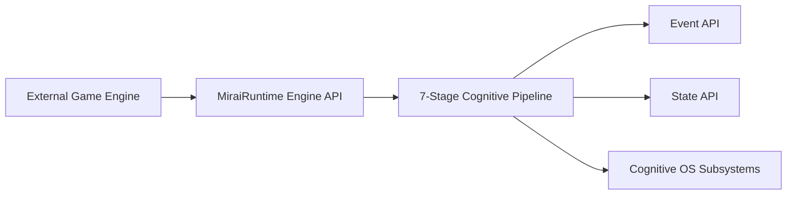
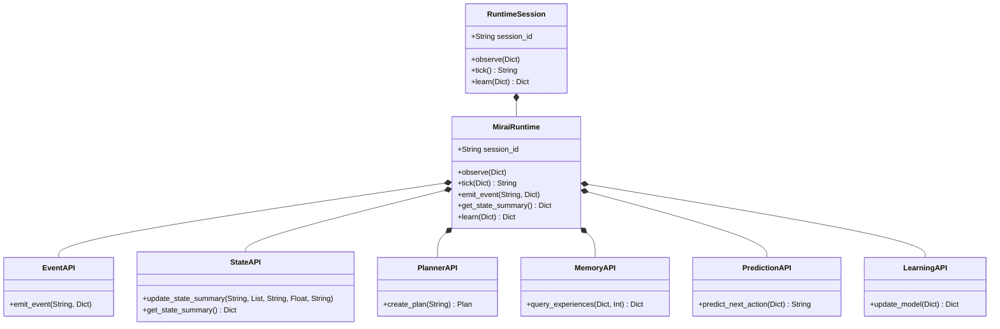

# MIRAI v2 — Cognitive API & Runtime Specification

> **Phase 15 Specification & Deliverable Documentation**  
> "Reusable Engine Abstraction. Decouples MIRAI's Cognitive OS from internal demo scripts so any external game engine (Unreal Engine 5, Unity, Custom Engine) can plug into MIRAI."

---

## 1. Purpose & Core Vision
The **Cognitive API & Runtime Layer** encapsulates all 12 Cognitive OS subsystems into a clean, reusable engine interface. Game engines emit high-level combat events, query decoupled state summaries, and execute a 7-stage cognitive processing pipeline through a single unified `tick()` function call.

---

## 2. System Architecture Diagram



---

## 3. Class Diagram & Component Hierarchy



---

## 4. 7-Stage Single Tick Scheduler Loop

```text
Observe -> Perceive -> Predict -> Plan -> Decide -> Execute -> Learn
```

```python
from backend.runtime.runtime import MiraiRuntime

# Initialize session
session = MiraiRuntime()

# 1. Emit combat event
session.emit_event("PlayerReloaded", {"player_id": "p1"})

# 2. Execute single-function tick pipeline
action = session.tick({"timestamp": 12.5, "metadata": {"player_hp": 34.0}})
print(f"Chosen Action for Game Engine: {action}")

# 3. Retrieve clean State summary
state = session.get_state_summary()
print(f"Goal: {state['current_goal']}, Confidence: {state['current_confidence'] * 100}%")
```

---

## 5. Updated System Roadmap

- **Phase 1** ✅ Cognitive Kernel (`v0.1-cognitive-kernel`)
- **Phase 2** ✅ Working Memory (`v0.2-working-memory`)
- **Phase 3** ✅ Episodic Memory (`v0.3-episodic-memory`)
- **Phase 4** ✅ Semantic Memory (`v0.4-semantic-memory`)
- **Phase 5** ✅ Decision Cortex (`v0.5-decision-cortex`)
- **Phase 6** ✅ Prediction Engine (`v0.6-prediction-engine`)
- **Phase 7** ✅ Continuous Learning Engine (`v0.7-continuous-learning`)
- **Phase 8** ✅ ML Infrastructure (`v0.8-ml-infrastructure`)
- **Phase 9 / 10** ✅ Real Machine Learning (XGBoost Intent Model) (`v0.9-real-ml`)
- **Phase 11** ✅ Temporal Intelligence (LSTM Sequence & Prediction Fusion) (`v1.0-temporal-intelligence`)
- **Phase 12** ✅ Vector Memory & Experience Retrieval (`v1.1-vector-memory`)
- **Phase 13** ✅ Strategic Planning System (`v1.2-strategic-planner`)
- **Phase 14** ✅ Simulation & Evaluation Framework (`v1.3-simulation-evaluation`)
- **Phase 15** ✅ Cognitive API & Runtime (`v1.4-cognitive-api-runtime`)
- **Phase 16** 🔄 LLM Cognitive Layer & Developer Insights
