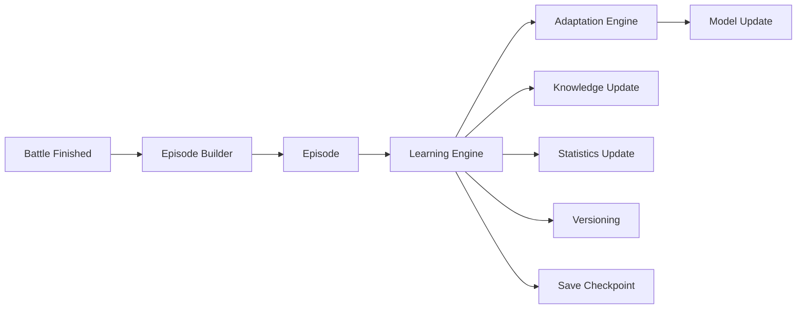
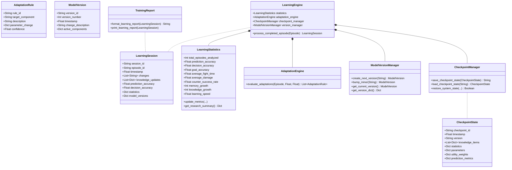

# MIRAI v2 — Continuous Learning Engine Specification

> **Phase 8 Specification & Deliverable Documentation**  
> "At the end of every match, MIRAI automatically asks: What did I learn? instead of what happened? The Learning Engine closes the cognitive loop and continuously adapts MIRAI's intelligence."

---

## 1. Purpose & Core Vision
The **Continuous Learning Engine** transforms MIRAI from a static decision-maker into a self-evolving cognitive system. Post-match, it evaluates prediction and decision accuracy, updates research-grade benchmark statistics, generates parameter adaptations (utility score deltas, confidence threshold adjustments), updates semantic version lineage (`Model v1 -> Model v2 -> Model v3`), and persists complete system state checkpoints.

---

## 2. Closed-Loop System Architecture Diagram



---

## 3. Class Diagram & Relationship Hierarchy



---

## 4. Closed-Loop Cognitive OS Pipeline (12-Stages)

$$\text{Telemetry} \to \text{Perception} \to \text{Attention} \to \text{Working Memory} \to \text{World Model} \to \text{Episodic Memory} \to \text{Semantic Memory} \to \text{Prediction} \to \text{Goal} \to \text{Utility} \to \text{Decision} \to \mathbf{\text{Learning Engine}}$$

---

## 5. 9 Research Benchmark Metrics Tracked

1. 🎯 **`prediction_accuracy`**
2. ⚖️ **`decision_accuracy`**
3. 🎯 **`goal_accuracy`**
4. ⏱ **`average_fight_time`**
5. ⚔️ **`average_damage`**
6. 🛡 **`counter_success_rate`**
7. 🧠 **`memory_growth`**
8. 📚 **`knowledge_growth`**
9. ⚡️ **`learning_speed`**

---

## 6. Post-Match Training Report Format

```text
==================================
Learning Report
==================================

Episode
34

Prediction Accuracy
96%

Decision Accuracy
88%

Knowledge Added
1

Knowledge Updated
4

Utility Changes
1

Learning Rate
Stable

Next Version
v1.0.1
==================================
```

---

## 7. Updated System Roadmap

- **Phase 1** ✅ Cognitive Kernel (`v0.1-cognitive-kernel`)
- **Phase 2** ✅ Working Memory (`v0.2-working-memory`)
- **Phase 3** ✅ Episodic Memory (`v0.3-episodic-memory`)
- **Phase 4** ✅ Semantic Memory (`v0.4-semantic-memory`)
- **Phase 5** ✅ Decision Cortex (`v0.5-decision-cortex`)
- **Phase 6** ✅ Prediction Engine (`v0.6-prediction-engine`)
- **Phase 7** ✅ Continuous Learning Engine (`v0.7-continuous-learning`)
- **Phase 8** 🔄 Vector Memory (FAISS + HNSW)
- **Phase 9** 🔄 LLM Cognitive Layer
- **Phase 10** 🔄 Team Intelligence
- **Phase 11** 🔄 Full Game Integration
