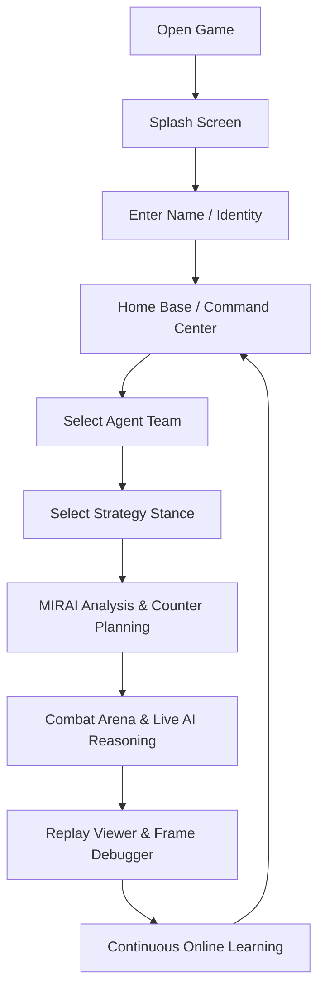

# MIRAI v2 — Core Gameplay Loop Specification

> **Core System Document**  
> "The single most important document in the project. Defines the closed-loop player journey from game launch to post-match continuous learning."

---

## 1. Core Gameplay Loop Diagram

---

## 2. Step-by-Step Loop Stages

1. **Open Game & Splash Screen:** Player initiates application. MIRAI greets operator ("I've been waiting.").
2. **Identity Setup:** Player inputs combat designation.
3. **Home Base / Command Center:** Access hub for Play, Brain Archive, Statistics, and Settings.
4. **Team Selection:** Choose from 4 unique hero agents (Cyber Knight, Shadow Ninja, Heavy Paladin, Arcane Mage).
5. **Strategy Planning:** Select tactical stance (Aggression, Kiting, Protect, Focus, Formation).
6. **MIRAI Analysis:** MIRAI scans team features, queries vector memory, and builds counter plans.
7. **Battle Arena:** Real-time 3D/2D combat arena with live "Watch AI Think" XAI reasoning panel.
8. **Replay Viewer:** Frame debugger scrubbing timestamped cognitive snapshots.
9. **Continuous Learning:** Post-match episode saving, memory updates, and brain checkpointing.
10. **Loop Re-Entry:** Return to Command Center for next match.
