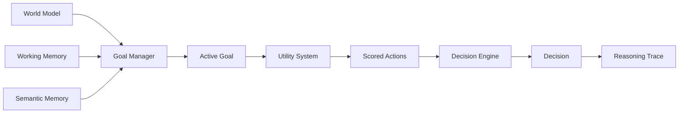
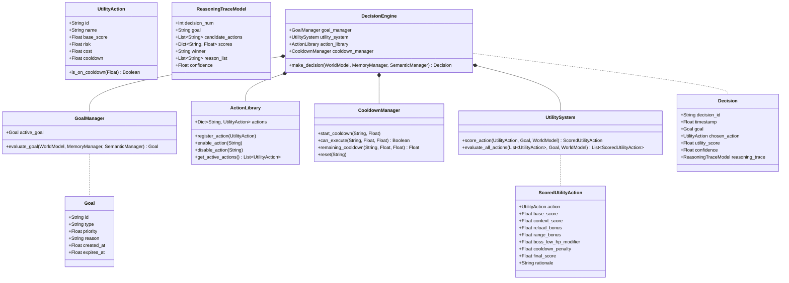

# MIRAI v2 — Decision Cortex Specification

> **Phase 6 Specification & Deliverable Documentation**  
> "Knowledge without decision-making is just a database. The Decision Cortex transforms working memory, semantic knowledge, and spatial beliefs into transparent, explainable tactical decisions."

---

## 1. Purpose & Core Vision
The **Decision Cortex** is the decision-making brain of MIRAI. It decouples **WHAT** high-level goal to pursue (`GoalManager`) from **HOW** to score and pick candidate tactical actions (`UtilitySystem` & `DecisionEngine`). Crucially, every decision generated outputs a transparent, human-readable **ReasoningTrace** audit log (Explainable AI).

---

## 2. System Architecture Diagram



---

## 3. Class Diagram & Relationship Hierarchy



---

## 4. Explainable Utility Scoring Formula

Every candidate action is scored using a transparent, deterministic utility equation:

$$\text{Final Score} = \text{Base Score} + \text{Reload Bonus} + \text{Range Bonus} + \text{Goal Bonus} + \text{Boss HP Modifier} - \text{Cooldown Penalty}$$

| Component | Description | Example Score |
| :--- | :--- | :--- |
| **Base Score** | Intrinsic baseline value of action | `HeavyAttack: 60` |
| **Reload Bonus** | Bonus when player reloading detected | `Player Reloading: +25` |
| **Range Bonus** | Bonus for optimal engagement range | `Optimal Range: +15` |
| **Boss HP Modifier** | Penalty/bonus based on boss health | `Low Boss HP: -30` |
| **Cooldown Penalty** | Disqualifying penalty if on cooldown | `Cooldown Active: -200` |

---

## 5. Interview-Worthy Reasoning Trace Audit Format

```text
==================================================
Decision #412

Goal
PRESSURE_PLAYER

Candidate Actions
HeavyAttack    91
Dash           62
Block          34
Heal           18

Chosen
HeavyAttack

Reasons
✓ Player Reloading
✓ Optimal Range
✓ Player Low HP
✓ Heavy Attack Ready

Confidence
91%
==================================================
```

---

## 6. Updated System Roadmap

With the Decision Cortex in place, MIRAI perceives, remembers, extracts patterns, chooses goals, and explains every decision cleanly without needing black-box ML. Deep Learning / ML models will now serve as modular prediction enhancers within this architecture.

- **Phase 1** ✅ Cognitive Kernel (`v0.1-cognitive-kernel`)
- **Phase 2** ✅ Working Memory (`v0.2-working-memory`)
- **Phase 3** ✅ Episodic Memory (`v0.3-episodic-memory`)
- **Phase 4** ✅ Semantic Memory (`v0.4-semantic-memory`)
- **Phase 5** ✅ Decision Cortex (`v0.5-decision-cortex`)
- **Phase 6** 🔄 Prediction Engine (ML / Trajectory / Intent)
- **Phase 7** 🔄 Continuous Learning & Retraining
- **Phase 8** 🔄 Vector Memory (FAISS + HNSW)
- **Phase 9** 🔄 LLM Cognitive Layer
- **Phase 10** 🔄 Team Intelligence
- **Phase 11** 🔄 Full Game Integration
