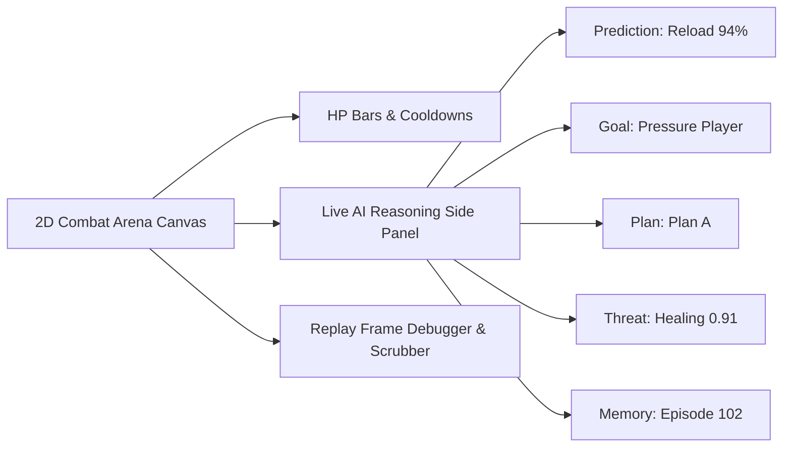

# MIRAI v2 — Demo Game & AI Debugger Vertical Slice Specification

> **Phase 19 Specification & Deliverable Documentation**  
> "Playable 2D Combat Arena & Real-Time AI Debugger. Allows recruiters, developers, and game designers to play a vertical slice and watch the AI think frame-by-frame."

---

## 1. Purpose & Core Vision
The **Demo Game Vertical Slice** turns MIRAI from an abstract API into a tangible, playable 2D combat arena. Players fight Boss AI in real-time while a side panel visualizes MIRAI's internal cognitive process. When paused, the **Frame Debugger** inspects exact prediction, threat, memory, plan, and decision snapshots at any target frame (e.g. Frame 130).

---

## 2. System Architecture Diagram



---

## 3. Playable Arena Layout

```text
+-------------------------------------------------------+
|  Player (Blue)       Boss AI (Red)     Obstacle Pillar |
|     ▲                     ▼             Health Pack   |
+-------------------------------------------------------+
| Live XAI Reasoning Panel:                             |
|   Prediction: Reload (94%)                            |
|   Goal:       Pressure Player                         |
|   Plan:       Plan A (Dash ➔ Heavy Attack)            |
|   Threat:     Healing = 0.91                          |
|   Memory:     Episode 102 (Cosine Sim 0.94)           |
|   Skill:      Expert (Score: 92)                      |
|   Action:     Dash                                    |
+-------------------------------------------------------+
```

---

## 4. Replay Frame Debugger (Frame 130)

$$\text{Frame 130} \longrightarrow \text{Prediction (Reload 94\%)} \longrightarrow \text{Memory (Ep 102)} \longrightarrow \text{Threat (Healing 0.91)} \longrightarrow \text{Plan (Interrupt)} \longrightarrow \text{Decision (Dash)}$$

---

## 5. Complete System Roadmap

- **Phase 1** ✅ Cognitive Kernel (`v0.1-cognitive-kernel`)
- **Phase 2** ✅ Working Memory (`v0.2-working-memory`)
- **Phase 3** ✅ Episodic Memory (`v0.3-episodic-memory`)
- **Phase 4** ✅ Semantic Memory (`v0.4-semantic-memory`)
- **Phase 5** ✅ Decision Cortex (`v0.5-decision-cortex`)
- **Phase 6** ✅ Prediction Engine (`v0.6-prediction-engine`)
- **Phase 7** ✅ Continuous Learning Engine (`v0.7-continuous-learning`)
- **Phase 8** ✅ ML Infrastructure (`v0.8-ml-infrastructure`)
- **Phase 9 / 10** ✅ Real Machine Learning (XGBoost Intent Model) (`v0.9-real-ml`)
- **Phase 11** ✅ Temporal Intelligence (LSTM Sequence & Prediction Fusion) (`v1.0-temporal-intelligence`)
- **Phase 12** ✅ Vector Memory & Experience Retrieval (`v1.1-vector-memory`)
- **Phase 13** ✅ Strategic Planning System (`v1.2-strategic-planner`)
- **Phase 14** ✅ Simulation & Evaluation Framework (`v1.3-simulation-evaluation`)
- **Phase 15** ✅ Cognitive API & Runtime (`v1.4-cognitive-api-runtime`)
- **Phase 16** ✅ Developer Tools & Visualization Suite (`v1.5-developer-tools-visualization`)
- **Phase 17** ✅ SDK, Threat Ranking, Skill Rating, Embeddings & Planner v2 (`v2.3-planner-v2-final`)
- **Phase 18** ✅ Explainability (XAI) Engine (`v2.4-explainability-xai`)
- **Phase 19** ✅ Demo Game & AI Debugger Vertical Slice (`v2.5-demo-game-vertical-slice`)
