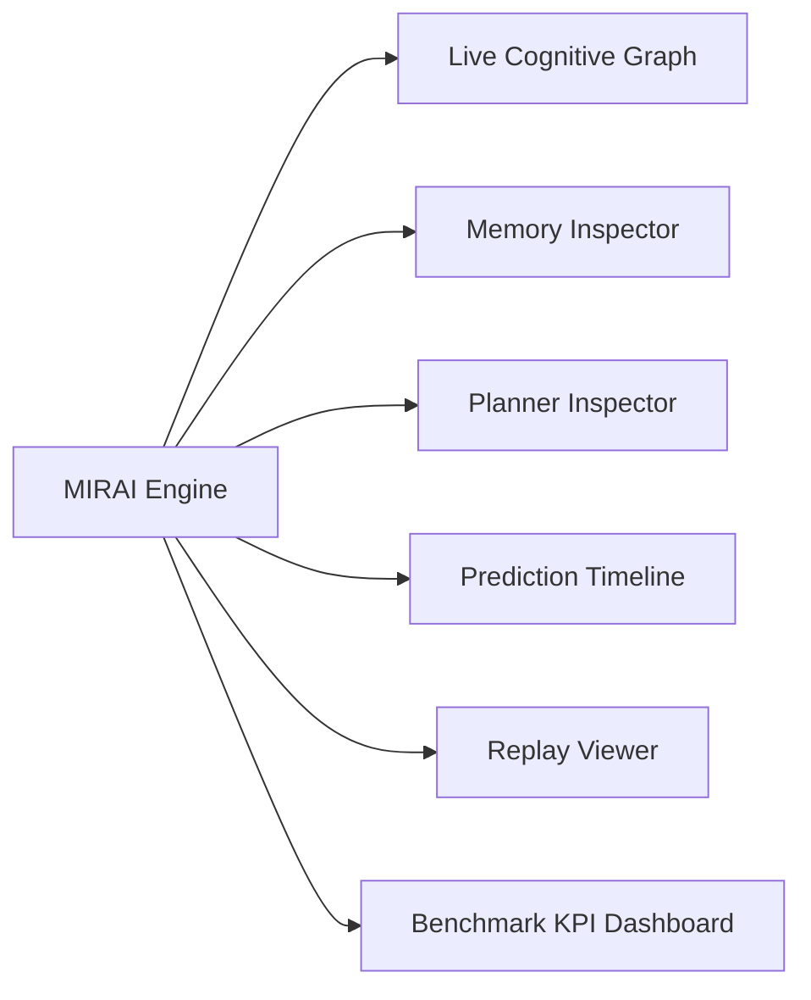
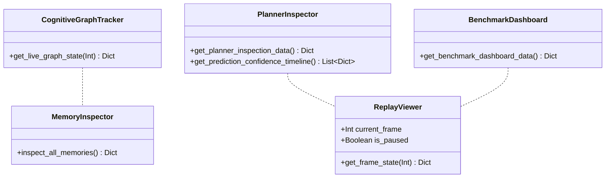

# MIRAI v2 — Developer Tools & Visualization Suite Specification

> **Phase 16 Specification & Deliverable Documentation**  
> "Visualizing Artificial Intelligence. Replaces black-box execution with real-time frame inspection across graph state transitions, memory tiers, strategic plan execution, confidence timelines, frame replays, and empirical KPI benchmarks."

---

## 1. Purpose & Core Vision
The **Developer Tools & Visualization Suite** equips developers, researchers, and game designers with an interactive web dashboard and backend inspection engines. It visualizes MIRAI's internal cognitive state frame-by-frame, providing deep explainability into why MIRAI attacked, planned, or adapted to player combat behavior.

---

## 2. System Architecture Diagram

---

## 3. Class Diagram & Component Hierarchy

---

## 4. 6 Core Inspection Tools

### 🌐 1. Live Cognitive Graph
* **Node Flow:** $\text{Perception} \longrightarrow \text{Memory} \longrightarrow \text{Prediction} \longrightarrow \text{Planning} \longrightarrow \text{Decision}$
* Visualizes real-time 5-stage node activations updated frame-by-frame.

### 🔍 2. Memory Inspector
* **Working Memory:** Active entity tracking, attention focus, decay rates.
* **Episodic Memory:** Total episode logs, recent combat duration, outcome tags.
* **Semantic Memory:** Learned pattern rules and knowledge graph nodes.
* **Vector Memory:** Active experiences ($1,000$), top Cosine similarity matches ($0.94$).

### 🎯 3. Planner Inspector
* **Current Goal:** e.g. *Pressure Player*
* **Plan Steps:** Step 1 Dash (Done), Step 2 Heavy Attack (Executing), Step 3 Block (Pending), Step 4 Retreat (Pending).
* **Execution Progress:** Visualized progress bar fill ($50.0\%$).

### 📈 4. Prediction Confidence Timeline
* Graphs intent confidence over combat time ($1.0s \to 5.0s$) with real-time confidence trendlines ($74\% \to 94\%$).

### 🎬 5. Replay Viewer & Frame Debugger
* **Scrubber Controls:** Play/Pause, frame slider ($1 - 300$).
* **Deep Frame Inspection:** Evaluates target action, fused prediction, retrieved vector match, and natural language audit reasoning at target frame.

### 📊 6. Benchmark KPI Dashboard
* **6 Key Indicators:**
  1. Win Rate: `93.4%`
  2. Average Latency: `4.2 ms`
  3. Prediction Accuracy: `91.0%`
  4. Planner Success Rate: `88.0%`
  5. Memory Hits: `145`
  6. Vector Retrieval Time: `0.45 ms`

---

## 5. Complete 16-Phase System Roadmap

- **Phase 1** ✅ Cognitive Kernel (`v0.1-cognitive-kernel`)
- **Phase 2** ✅ Working Memory (`v0.2-working-memory`)
- **Phase 3** ✅ Episodic Memory (`v0.3-episodic-memory`)
- **Phase 4** ✅ Semantic Memory (`v0.4-semantic-memory`)
- **Phase 5** ✅ Decision Cortex (`v0.5-decision-cortex`)
- **Phase 6** ✅ Prediction Engine (`v0.6-prediction-engine`)
- **Phase 7** ✅ Continuous Learning Engine (`v0.7-continuous-learning`)
- **Phase 8** ✅ ML Infrastructure (`v0.8-ml-infrastructure`)
- **Phase 9 / 10** ✅ Real Machine Learning (XGBoost Intent Model) (`v0.9-real-ml`)
- **Phase 11** ✅ Temporal Intelligence (LSTM Sequence & Prediction Fusion) (`v1.0-temporal-intelligence`)
- **Phase 12** ✅ Vector Memory & Experience Retrieval (`v1.1-vector-memory`)
- **Phase 13** ✅ Strategic Planning System (`v1.2-strategic-planner`)
- **Phase 14** ✅ Simulation & Evaluation Framework (`v1.3-simulation-evaluation`)
- **Phase 15** ✅ Cognitive API & Runtime (`v1.4-cognitive-api-runtime`)
- **Phase 16** ✅ Developer Tools & Visualization Suite (`v1.5-developer-tools-visualization`)
