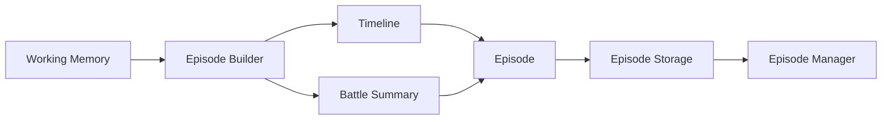
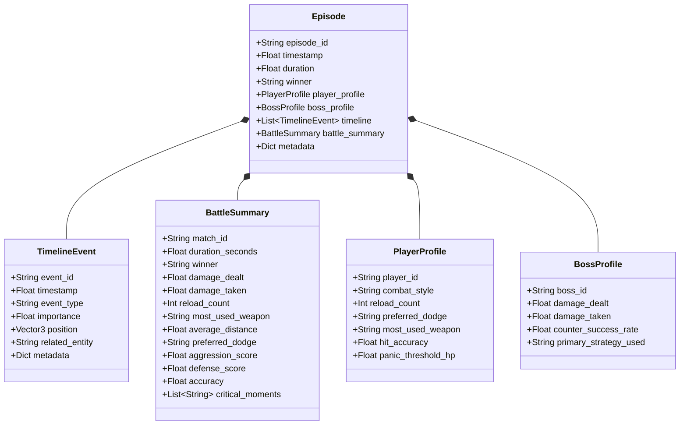

# MIRAI v2 — Episodic Memory (Battle Memory Specification)

> **Phase 4 Specification & Deliverable Documentation**  
> "Working Memory answers what happened in the last few seconds. Episodic Memory answers what happened in Battle #12."

---

## 1. Purpose & Core Vision
Episodic Memory provides MIRAI with long-term, cross-session battle memory. Rather than storing millions of raw 60 Hz frame telemetry records (which wastes space and introduces noise), Episodic Memory captures discrete, high-saliency **Timeline Events** and summarizes thousands of combat ticks into compact, ML-ready **Battle Summaries**.

---

## 2. System Architecture Diagram



---

## 3. Class Diagram & Relationship Hierarchy



---

## 4. Master JSON Schema Specification

Completed episodes are serialized as structured JSON files inside `backend/data/episodes/Episode_XXXXX.json`.

```json
{
  "episode_id": "Episode_00012",
  "timestamp": 1722000000.0,
  "duration": 82.0,
  "winner": "Player",
  "player_profile": {
    "player_id": "player_raja_01",
    "combat_style": "Aggressive",
    "reload_count": 15,
    "preferred_dodge": "Left",
    "most_used_weapon": "Shotgun",
    "hit_accuracy": 0.75,
    "panic_threshold_hp": 30.0
  },
  "boss_profile": {
    "boss_id": "boss_mirai",
    "damage_dealt": 450.0,
    "damage_taken": 850.0,
    "counter_success_rate": 0.8,
    "primary_strategy_used": "Standard_Engage"
  },
  "timeline": [
    {
      "event_id": "mem_obs_PlayerReloading_1005",
      "timestamp": 1005.0,
      "event_type": "Player Reloaded",
      "importance": 90.0,
      "position": {"x": 12.1, "y": 0.0, "z": 5.2},
      "related_entity": "player_raja_01",
      "metadata": {}
    }
  ],
  "battle_summary": {
    "match_id": "Episode_00012",
    "duration_seconds": 82.0,
    "winner": "Player",
    "damage_dealt": 450.0,
    "damage_taken": 850.0,
    "reload_count": 15,
    "most_used_weapon": "Shotgun",
    "average_distance": 6.2,
    "preferred_dodge": "Left",
    "aggression_score": 0.88,
    "defense_score": 0.35,
    "accuracy": 0.75,
    "critical_moments": [
      "Key Event: Player Reloaded at t=1005.0s"
    ],
    "metrics": {}
  },
  "metadata": {}
}
```

---

## 5. Storage Strategy & Data Flow

1. **Working Memory Integration:** `EpisodeBuilder` listens to real-time `WORKING_MEMORY_UPDATED` events emitted by `MemoryManager`.
2. **Saliency Filtering:** Only events with importance scores $\ge 60.0$ are appended to the `TimelineEvent` sequence.
3. **Statistical Aggregation:** Micro-stats (reload counts, dodge direction distributions, average engagement distance, damage ratios) are updated frame-by-frame.
4. **Match Finalization:** When `finish_episode(winner)` is triggered, `EpisodeBuilder` packages the `PlayerProfile`, `BossProfile`, `BattleSummary`, and `TimelineEvent` list into a single `Episode` object.
5. **Disk Persistence:** `EpisodeStorage` serializes the episode to `backend/data/episodes/{episode_id}.json`.

---

## 6. Query Capabilities

`EpisodeManager` supports high-level queries across historical episodes:
- **Search by ID:** `episode_manager.search_by_id("00012")`
- **List All Encounters:** `episode_manager.list_episodes()`
- **Load Complete Episode:** `episode_manager.load_episode("Episode_00012")`
- **Delete Episode:** `episode_manager.delete_episode("Episode_00012")`

---

## 7. Limitations & Future Expansion

- **Current Limitations:** Storage relies on direct JSON file disk reads. Linear searches (`search_by_id`) scale well for hundreds of battles, but will require indexing for tens of thousands of matches.
- **Future Expansion:** In later phases, `EpisodeStorage` will feed vector embeddings into **FAISS + HNSW** for semantic similarity search (e.g. *"Retrieve historical encounters where player used Shotgun and dodged left under low HP"*).
