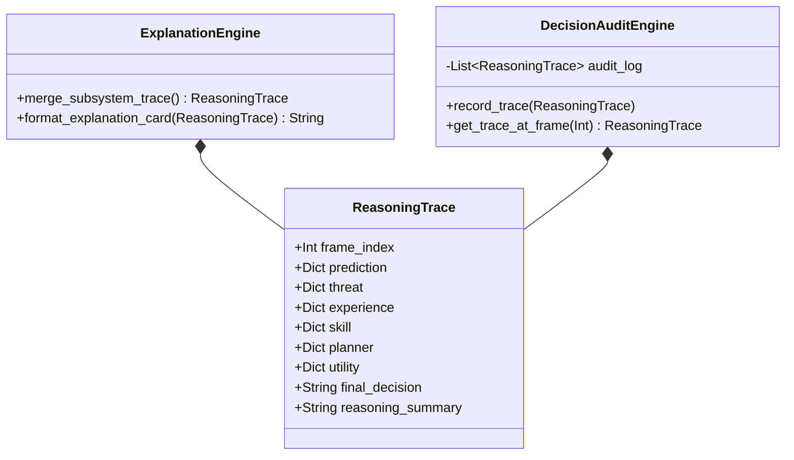

# MIRAI v2 — Explainability (XAI) Engine Specification

> **Phase 18 Specification & Deliverable Documentation**  
> "First-principles Explainable AI (XAI). Transforms black-box decision making into transparent, multi-subsystem reasoning traces across Prediction, Threat, Experience, Skill Rating, Planner, Utility AI, and Final Decisions."

---

## 1. Purpose & Core Vision
The **Explainability (XAI) Engine** captures frame-by-frame evidence from all 12 Cognitive OS subsystems. Instead of acting as an opaque black box, MIRAI outputs structured reasoning traces detailing *why* an action was chosen over alternatives.

---

## 2. System Architecture Diagram


---

## 3. Class Diagram & Component Hierarchy



---

## 4. Multi-Subsystem Reasoning Trace Output Card

```text
====================================
Decision: Dash
====================================

Reasoning

Prediction
-------------
Reload (94%)

Threat
-------------
Healing = 0.91

Experience
-------------
Episode 102
Similarity 0.94

Skill Rating
-------------
Expert (92)

Planner
-------------
Plan A

Goal
-------------
Pressure Player

Utility
-------------
Dash: 0.88
Block: 0.63

Final Decision
-------------
Dash
====================================
```

---

## 5. Complete System Roadmap

- **Phase 1** ✅ Cognitive Kernel (`v0.1-cognitive-kernel`)
- **Phase 2** ✅ Working Memory (`v0.2-working-memory`)
- **Phase 3** ✅ Episodic Memory (`v0.3-episodic-memory`)
- **Phase 4** ✅ Semantic Memory (`v0.4-semantic-memory`)
- **Phase 5** ✅ Decision Cortex (`v0.5-decision-cortex`)
- **Phase 6** ✅ Prediction Engine (`v0.6-prediction-engine`)
- **Phase 7** ✅ Continuous Learning Engine (`v0.7-continuous-learning`)
- **Phase 8** ✅ ML Infrastructure (`v0.8-ml-infrastructure`)
- **Phase 9 / 10** ✅ Real Machine Learning (XGBoost Intent Model) (`v0.9-real-ml`)
- **Phase 11** ✅ Temporal Intelligence (LSTM Sequence & Prediction Fusion) (`v1.0-temporal-intelligence`)
- **Phase 12** ✅ Vector Memory & Experience Retrieval (`v1.1-vector-memory`)
- **Phase 13** ✅ Strategic Planning System (`v1.2-strategic-planner`)
- **Phase 14** ✅ Simulation & Evaluation Framework (`v1.3-simulation-evaluation`)
- **Phase 15** ✅ Cognitive API & Runtime (`v1.4-cognitive-api-runtime`)
- **Phase 16** ✅ Developer Tools & Visualization Suite (`v1.5-developer-tools-visualization`)
- **Phase 17** ✅ SDK, Threat Ranking, Skill Rating, Embeddings & Planner v2 (`v2.3-planner-v2-final`)
- **Phase 18** ✅ Explainability (XAI) Engine (`v2.4-explainability-xai`)
