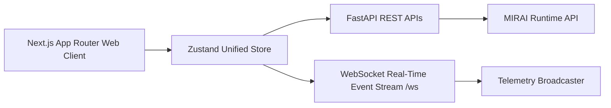

# MIRAI v2 — Full-Stack Next.js Web Application Specification

> **Phases 1-5 Specification & Deliverable Documentation**  
> "Production Next.js Web Application & Real-Time AI Telemetry Dashboard. Integrates 10 designed screens, Zustand state management, and live WebSocket telemetry with the FastAPI backend."

---

## 1. Purpose & Core Vision
The **Full-Stack Web Application** brings MIRAI to life in a modern, production-grade Web application built with Next.js, TypeScript, Tailwind CSS, Framer Motion, Three.js / R3F, and Zustand. It connects live to the FastAPI backend over REST (`http://localhost:8000/api`) and WebSocket event streams (`ws://localhost:8000/ws`).

---

## 2. System Architecture Diagram



---

## 3. 10 Screen User Flow

```text
Screen 1: Splash Screen ("MIRAI -> I've been waiting -> ENTER THE CORE")
   ↓
Screen 2: Name Entry ("Identify Yourself -> Enter Designation")
   ↓
Screen 3: Home Command Center ("Play | Brain Archive | Replay Viewer | Benchmarks")
   ↓
Screen 4: Hero Selection ("4 Heroes | Abilities | Voice | Character Viewer")
   ↓
Screen 5: Strategy Planning ("Aggression | Kiting | Protect | Focus | Formation")
   ↓
Screen 6: MIRAI Analysis ("Scanning | Thinking | Building Counter | Loading Memory")
   ↓
Screen 7: Battle Arena ("Playable 2D Combat Canvas + Live XAI Reasoning Panel")
   ↓
Screen 8: Brain View ("Interactive Cognitive Graph & Subsystems Flow")
   ↓
Screen 9: Replay Viewer ("Frame Debugger & Replay Scrubber - Frame 130")
   ↓
Screen 10: Learning Screen ("Continuous Online Learning & Ablation Benchmarks")
```

---

## 4. Zustand Store Architecture (`web/src/store/useMiraiStore.ts`)

Encapsulates global application state across:
* **Player State:** `playerName`, `selectedHero`, `strategyChoice`
* **Battle Telemetry:** `playerHp`, `bossHp`, `lastPlayerAction`, `lastBossAction`
* **Cognitive Subsystem State:** `predictedIntent`, `predictionConfidence`, `threatScore`, `activeGoal`, `activePlan`, `retrievedMemory`, `playerSkillTier`
* **Replay State:** `replayFrame`, `scrubSnapshot`

---

## 5. Live WebSocket Integration (`web/src/services/websocketService.ts`)

Connects to `ws://localhost:8000/ws` and updates the Zustand store in real-time without artificial delay or mock data.

---

## 6. Complete System Roadmap

- **Phase 0** ✅ Backend Freeze (REST APIs & WebSockets) (`v3.2-backend-freeze`)
- **Phases 1-5** ✅ Full-Stack Next.js Web Application & Real-Time Telemetry (`v4.0-fullstack-web-app`)
