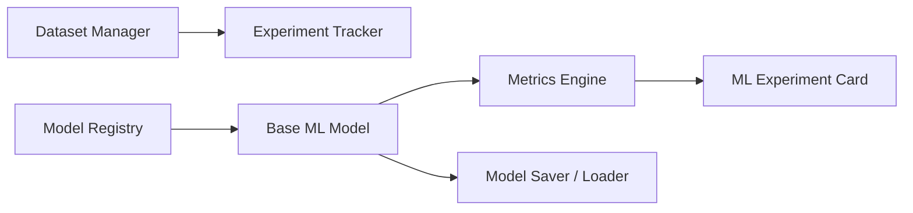
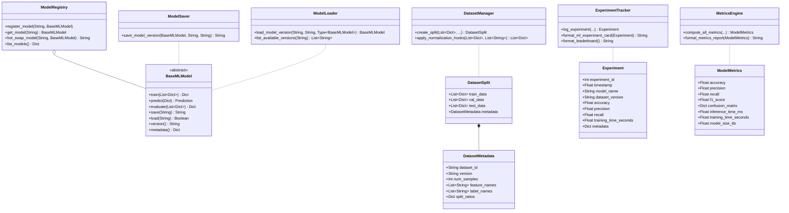

# MIRAI v2 — ML Infrastructure Specification

> **Phase 9 Specification & Deliverable Documentation**  
> "After this phase, training any new predictor becomes a simple one-file task. Plug in XGBoost, LightGBM, PyTorch LSTM, or Transformers without altering a single line of Cognitive OS code."

---

## 1. Purpose & Core Vision
The **ML Infrastructure** provides the standardized plug-and-play foundation for Machine Learning models in MIRAI. By decoupling model implementation (`BaseMLModel`) from the Cognitive OS architecture, any algorithm can be registered, evaluated, hot-swapped, and benchmarked scientifically across standardized datasets and experiment leaderboards.

---

## 2. System Architecture Diagram



---

## 3. Class Diagram & Relationship Hierarchy



---

## 4. ML Experiment Console Output Format

```text
========================================
ML Experiment
========================================

Model
Baseline Predictor

Dataset
v5

Train Samples
18,240

Validation
2,340

Accuracy
74%

Precision
71%

Recall
72%

Inference
0.3 ms

Status
PASS
========================================
```

---

## 5. Model File Versioning Hierarchy (No "latest.pkl")

- `backend/data/models/intent_prediction/v1.0.bin`
- `backend/data/models/intent_prediction/v1.1.bin`
- `backend/data/models/intent_prediction/v1.2.bin`

Sidecar JSON metadata files (`v1.0_metadata.json`) guarantee reproducible model loading and rollback.

---

## 6. Updated System Roadmap

- **Phase 1** ✅ Cognitive Kernel (`v0.1-cognitive-kernel`)
- **Phase 2** ✅ Working Memory (`v0.2-working-memory`)
- **Phase 3** ✅ Episodic Memory (`v0.3-episodic-memory`)
- **Phase 4** ✅ Semantic Memory (`v0.4-semantic-memory`)
- **Phase 5** ✅ Decision Cortex (`v0.5-decision-cortex`)
- **Phase 6** ✅ Prediction Engine (`v0.6-prediction-engine`)
- **Phase 7** ✅ Continuous Learning Engine (`v0.7-continuous-learning`)
- **Phase 8** ✅ ML Infrastructure (`v0.8-ml-infrastructure`)
- **Phase 9** 🔄 Real Machine Learning (XGBoost & PyTorch LSTMs)
- **Phase 10** 🔄 Vector Memory (FAISS + HNSW)
- **Phase 11** 🔄 LLM Cognitive Layer, Team Intelligence, & Game Integration
