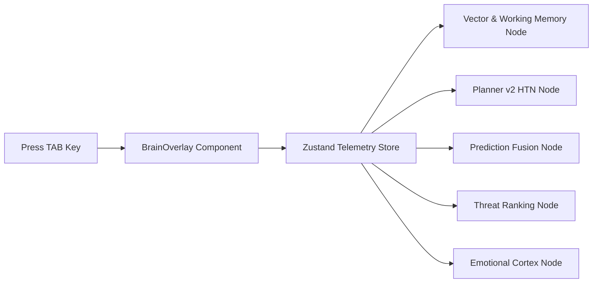

# MIRAI v2 — Phases 11-15: Brain Overlay, Replay, Online Learning, Audio & Polish Specification

> **Phases 11-15 Specification & Deliverable Documentation**  
> "Interactive Brain View Overlay, Timestamp Replay Restoration, Post-Battle Online Learning, Audio SFX Engine, and Visual Polish. Completes full-stack MIRAI OS framework."

---

## 1. Purpose & Core Vision
Phases 11 through 15 finalize the user experience for MIRAI v2:
* **Phase 11 (Brain View Overlay):** TAB key activates a real-time glassmorphic overlay displaying Memory, Planner, Prediction, Threat, Emotion, and Skill telemetry.
* **Phase 12 (Replay Scrubber):** Scrubbing the timeline restores exact cognitive states at any frame index.
* **Phase 13 (Continuous Online Learning):** Automated post-battle learning pipeline:
  $$\text{Battle Finished} \longrightarrow \text{Episode Saved} \longrightarrow \text{Memory Updated} \longrightarrow \text{Planner Updated} \longrightarrow \text{Prediction Improved} \longrightarrow \text{Brain Saved}$$
* **Phase 14 (Audio Engine):** Web Audio & Howler.js triggers for Agent actions and MIRAI voice cues.
* **Phase 15 (Visual Polish):** Framer Motion micro-animations, particle glow effects, and dynamic lighting.

---

## 2. Interactive TAB Key Brain Overlay Architecture



---

## 3. Final Project Directory Structure

```text
MIRAI/
├── web/                           # Frontend Web Application (Next.js 16 + R3F + Tailwind + Zustand)
│   ├── src/
│   │   ├── app/                   # App Router Pages & Global BrainOverlay
│   │   ├── components/            # Screens (10 Screens) & Reusable UI Components
│   │   │   ├── screens/           # Splash, NameEntry, Home, HeroSelect, Strategy, Analysis, Battle, BrainView, Replay, Learning
│   │   │   ├── ui/                # Button, Card, HealthBar, PlannerNode
│   │   │   └── overlays/          # BrainOverlay (TAB Triggered)
│   │   ├── game/                  # 3D R3F Arena & Combat Engine
│   │   │   ├── 3d/                # Arena3D.tsx (React Three Fiber)
│   │   │   └── combat/            # CombatEngine.ts
│   │   ├── services/              # API Service, WebSocket Service, Character Service, Audio Service, MiraiConnector
│   │   ├── store/                 # useMiraiStore.ts (Unified Zustand Store)
│   │   └── data/                  # characters.json
│
├── backend/                       # Backend Cognitive OS Engine (FastAPI + Python 3.11)
│   ├── api/                       # REST API Router (/state, /memory, /planner, /battle/*) & WebSocket Telemetry (/ws)
│   ├── cognitive_os/              # Sensing, Memory, ML, Prediction, Threat, Skill, Planner v2, XAI, Learning
│   ├── runtime/                   # MiraiRuntime 7-Stage Tick Loop
│   └── developer_tools/           # Replay Viewer, Cognitive Graph Tracker, Benchmark Dashboard
│
├── sdk/                           # Multi-Language SDKs (Python, C#, C++, JavaScript)
├── plugins/                       # Swappable Prediction, Planner, Memory Plugins
└── docs/                          # Architecture & Framework Specifications
```

---

## 4. Complete System Roadmap & Milestones

- **Phase 0** ✅ Backend Freeze (REST APIs & WebSockets) (`v3.2-backend-freeze`)
- **Phases 1-5** ✅ Full-Stack Next.js Web Application (`v4.0-fullstack-web-app`)
- **Phases 6-10** ✅ UI Components, Character System, R3F Arena, Combat & Connector (`v4.1-ui-character-r3f-connector`)
- **Phases 11-15** ✅ TAB Brain Overlay, Replay Restoration, Online Learning, Audio & Polish (`v5.0-mirai-final-release`)
