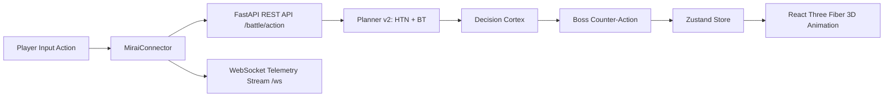

# MIRAI v2 — Phases 6-10: UI Design System, Characters, R3F 3D Arena, Combat & MIRAI Connector Specification

> **Phases 6-10 Specification & Deliverable Documentation**  
> "Component Architecture, R3F 3D Arena, and Backend-Driven Animation Pipeline. Implements modular UI components, JSON-driven character profiles, React Three Fiber 3D graphics, combat mechanics, and live backend connection."

---

## 1. Purpose & Core Vision
Phases 6 through 10 establish a production-grade full-stack architecture where **the backend controls everything**. Instead of local bot decision scripts, the frontend captures player actions, transmits them via `MiraiConnector` over REST and WebSockets to MIRAI's HTN + Behavior Tree Planner and Decision Cortex, and drives 3D R3F combat animations based on real-time backend decisions.

---

## 2. Backend-to-Frontend Animation Connection Diagram



---

## 3. Reusable UI Component Architecture (Phase 6)

* **[`Button.tsx`](file:///D:/MIRAI_V/MIRAI/web/src/components/ui/Button.tsx):** Framer Motion animated buttons with `primary`, `secondary`, `danger`, `warning`, `purple` variants.
* **[`Card.tsx`](file:///D:/MIRAI_V/MIRAI/web/src/components/ui/Card.tsx):** Glassmorphism cards with colored glow borders (`blue`, `purple`, `emerald`, `amber`, `red`).
* **[`HealthBar.tsx`](file:///D:/MIRAI_V/MIRAI/web/src/components/ui/HealthBar.tsx):** Dual-variant (`boss` vs `player`) health status bars.
* **[`PlannerNode.tsx`](file:///D:/MIRAI_V/MIRAI/web/src/components/ui/PlannerNode.tsx):** HTN / Behavior Tree execution nodes (`COMPLETED`, `EXECUTING`, `PENDING`).

---

## 4. Character System Schema (Phase 7 — `characters.json`)

```json
[
  {
    "id": "cyber_knight",
    "name": "Cyber Knight",
    "role": "Melee Duelist",
    "voice": "Tactical Cyber Voice",
    "abilities": ["Plasma Slash", "Dash Strike", "Shield Block"],
    "animations": ["idle", "run", "attack", "heavy_attack", "dash", "ultimate", "death"],
    "portrait": "/assets/portraits/cyber_knight.png",
    "model": "/assets/models/cyber_knight.glb",
    "ultimate": "Cyber Overload Slash",
    "description": "Agile close-quarters specialist with rapid plasma sword combos."
  }
]
```

---

## 5. React Three Fiber 3D Arena (Phase 8 — `Arena3D.tsx`)

Renders a 3D environment featuring Ground plane, Obstacle Pillar, Directional / Point lights, Camera controls, Player mesh (blue emissive), and Boss AI mesh (red emissive).

---

## 6. Combat Engine & Backend Connector (Phases 9 & 10)

* **`CombatEngine.ts`**: Pure combat mechanics (`BasicAttack`, `HeavyAttack`, `Dash`, `Heal`, `Ultimate`, `Death`).
* **`MiraiConnector.ts`**: Asynchronous connector executing the pipeline:
  $$\text{Player Action} \longrightarrow \mathbf{\text{MiraiConnector}} \longrightarrow \mathbf{\text{FastAPI REST + WebSocket}} \longrightarrow \mathbf{\text{Planner v2 \& Decision Cortex}} \longrightarrow \mathbf{\text{Zustand Store}} \longrightarrow \mathbf{\text{R3F Animation}}$$

---

## 7. Complete System Roadmap

- **Phase 0** ✅ Backend Freeze (REST APIs & WebSockets) (`v3.2-backend-freeze`)
- **Phases 1-5** ✅ Full-Stack Next.js Web Application & Real-Time Telemetry (`v4.0-fullstack-web-app`)
- **Phases 6-10** ✅ UI Components, Character System, R3F 3D Arena, Combat & MIRAI Connector (`v4.1-ui-character-r3f-connector`)
