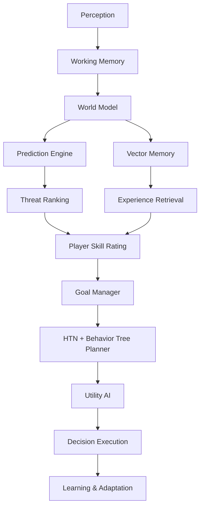
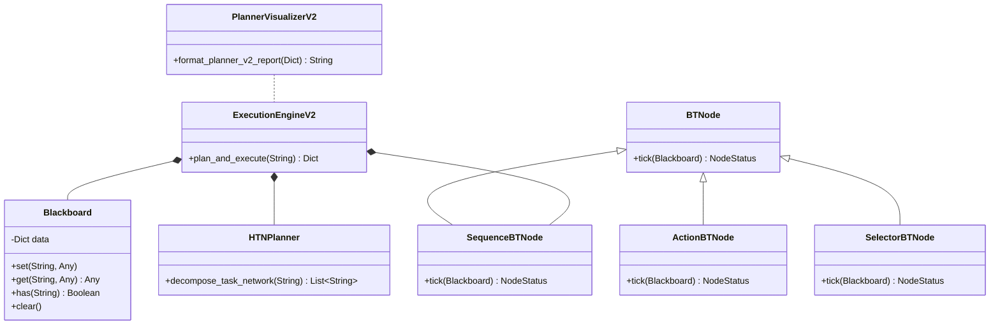

# MIRAI v2 — Planner v2 & Final System Architecture Specification

> **Phase 17 Step 4 Specification & Deliverable Documentation**  
> "Hierarchical Planning & Behavior Tree Execution. Integrates HTN Task Networks with reactive Behavior Trees, swappable EmbeddingProviders, Threat Ranking, and Player Skill Adaptation into MIRAI's unified architecture."

---

## 1. Purpose & Core Vision
**Planner v2** combines long-term hierarchical goal decomposition (**HTN Planner**) with reactive frame execution, priorities, and interruptions (**Behavior Tree**). Coupled with the **EmbeddingProvider** abstraction, **Threat Ranking**, and **Player Skill Adaptation**, it completes MIRAI's final production architecture.

---

## 2. Final System Architecture Diagram



---

## 3. Class Diagram & Component Hierarchy



---

## 4. HTN Decomposition & Behavior Tree Pipeline Example

```text
====================================
Planner v2 (HTN + Behavior Tree)
====================================
Goal: WIN

HTN Task Network Hierarchy:
  1. Reduce HP
  2. Pressure
  3. Force Reload
  4. Punish
  5. Retreat

Behavior Tree Execution Status: SUCCESS
====================================
```

---

## 5. Phase 17 Milestones Summary

| Milestone | Subsystem | Description | Tests | Release Tag |
| :--- | :--- | :--- | :--- | :--- |
| **Phase 17A** | **Threat Ranking** | 17-feature XGBoost Threat Ranker | `271 tests` | `v2.1-threat-ranking` |
| **Phase 17B** | **Player Skill Rating** | 0-100 skill score & strategy adaptation | `274 tests` | `v2.2-skill-embeddings` |
| **Phase 17C** | **Learned Embeddings** | `EmbeddingProvider` interface & Providers | `282 tests` | `v2.2-skill-embeddings` |
| **Phase 17D** | **Planner v2** | Behavior Tree + HTN Planner | `287 tests` | `v2.3-planner-v2-final` |

---

## 6. Complete System Roadmap

- **Phase 1** ✅ Cognitive Kernel (`v0.1-cognitive-kernel`)
- **Phase 2** ✅ Working Memory (`v0.2-working-memory`)
- **Phase 3** ✅ Episodic Memory (`v0.3-episodic-memory`)
- **Phase 4** ✅ Semantic Memory (`v0.4-semantic-memory`)
- **Phase 5** ✅ Decision Cortex (`v0.5-decision-cortex`)
- **Phase 6** ✅ Prediction Engine (`v0.6-prediction-engine`)
- **Phase 7** ✅ Continuous Learning Engine (`v0.7-continuous-learning`)
- **Phase 8** ✅ ML Infrastructure (`v0.8-ml-infrastructure`)
- **Phase 9 / 10** ✅ Real Machine Learning (XGBoost Intent Model) (`v0.9-real-ml`)
- **Phase 11** ✅ Temporal Intelligence (LSTM Sequence & Prediction Fusion) (`v1.0-temporal-intelligence`)
- **Phase 12** ✅ Vector Memory & Experience Retrieval (`v1.1-vector-memory`)
- **Phase 13** ✅ Strategic Planning System (`v1.2-strategic-planner`)
- **Phase 14** ✅ Simulation & Evaluation Framework (`v1.3-simulation-evaluation`)
- **Phase 15** ✅ Cognitive API & Runtime (`v1.4-cognitive-api-runtime`)
- **Phase 16** ✅ Developer Tools & Visualization Suite (`v1.5-developer-tools-visualization`)
- **Phase 17A** ✅ Threat Ranking Engine (`v2.1-threat-ranking`)
- **Phase 17B / 17C** ✅ Skill Rating & EmbeddingProvider (`v2.2-skill-embeddings`)
- **Phase 17D** ✅ Planner v2 (Behavior Tree + HTN Planner) (`v2.3-planner-v2-final`)
