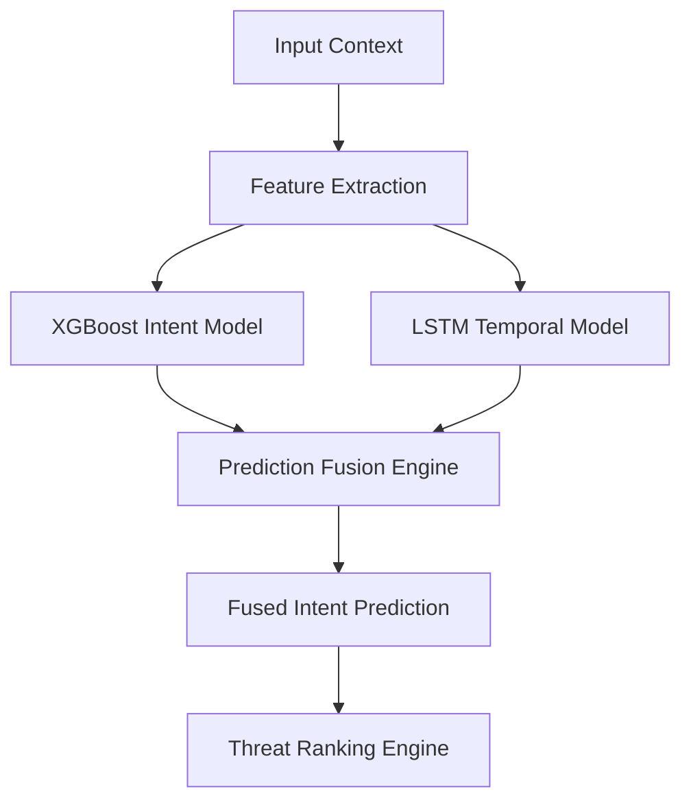

# MIRAI v2 — Prediction Engine Specification

## 1. Purpose
The **Prediction Engine** forecasts player combat intents (e.g. `Reload`, `Attack`, `Dodge`, `Heal`) before they occur, allowing MIRAI to counter preemptively.

---

## 2. Prediction Pipeline



---

## 3. Key Classes
* **`IntentPredictionModel`**: XGBoost classifier trained on combat features.
* **`LSTMTemporalModel`**: Sequence prediction neural network for temporal patterns.
* **`PredictionFusionEngine`**: Calibrates and fuses predictions into single high-confidence outputs.

---

## 4. Code Example

```python
from backend.cognitive_os.ml.fusion.fusion_engine import PredictionFusionEngine

fusion = PredictionFusionEngine()
res = fusion.fuse_predictions(xgb_pred="Reload", xgb_conf=0.91, lstm_pred="Reload", lstm_conf=0.96)
print(f"Fused Prediction: {res['fused_prediction']} ({res['fused_confidence']*100:.0f}%)")
```
