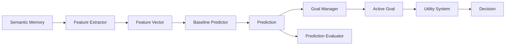
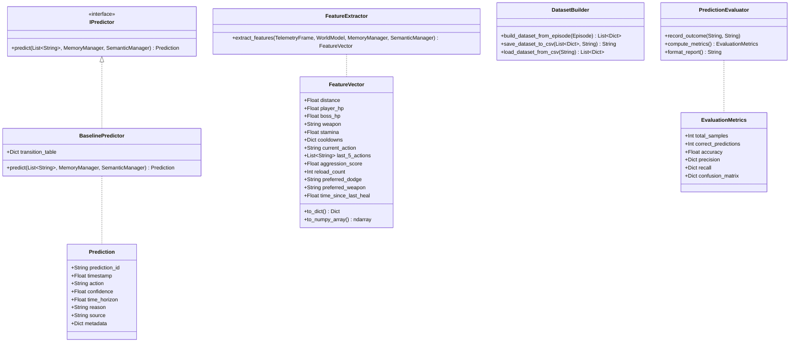

# MIRAI v2 — Prediction Engine Specification

> **Phase 7 Specification & Deliverable Documentation**  
> "Machine Learning should answer one question only: What will probably happen next? Not what should I do. Decision-making is solved by the Decision Cortex. Now we improve it with Prediction."

---

## 1. Purpose & Core Vision
The **Prediction Engine** is MIRAI's first ML module. It forecasts future player actions (`Reload`, `Dodge`, `Heal`, `Attack`, `Retreat`, `Block`) before they occur. By establishing a statistical non-ML `BaselinePredictor` (Markov transition frequencies & sequence rules), MIRAI sets a rigorous benchmark for evaluating future XGBoost, LightGBM, and PyTorch DL models.

---

## 2. System Architecture Diagram



---

## 3. Class Diagram & Relationship Hierarchy



---

## 4. 13 ML Features Specification & Dataset Generation

`FeatureExtractor` converts active Game State into structured tabular feature vectors for ML training:

| Feature Column | Type | Example |
| :--- | :--- | :--- |
| `distance` | `float` | `10.0m` |
| `player_hp` | `float` | `85.0` |
| `boss_hp` | `float` | `75.0` |
| `weapon` | `str` | `"Shotgun"` |
| `stamina` | `float` | `90.0` |
| `cooldowns` | `Dict` | `{"HeavyAttack": 0.0}` |
| `current_action` | `str` | `"RELOAD"` |
| `last_5_actions` | `List[str]` | `["Attack", "Attack", "Attack", "Reload"]` |
| `aggression_score` | `float` | `0.85` |
| `reload_count` | `int` | `15` |
| `preferred_dodge` | `str` | `"Left"` |
| `preferred_weapon` | `str` | `"Shotgun"` |
| `time_since_last_heal` | `float` | `42.5s` |

`DatasetBuilder` generates supervised learning CSV datasets inside `backend/data/datasets/training_dataset.csv` with target labels (`y = target_next_action`).

---

## 5. ML Evaluation Report Format

```text
=============================================
PREDICTION ENGINE ML EVALUATION REPORT
=============================================
Total Samples Tested: 10
Overall Accuracy:     80.0%

Per-Action Precision & Recall
-----------------------------
Dodge          | Precision:  80.0% | Recall:  80.0%
Reload         | Precision:  80.0% | Recall:  80.0%

Confusion Matrix (Rows: Actual, Cols: Predicted)
------------------------------------------------
Actual Reload     -> [Reload:4, Dodge:1]
Actual Dodge      -> [Reload:1, Dodge:4]
=============================================
```

---

## 6. Updated System Roadmap

- **Phase 1** ✅ Cognitive Kernel (`v0.1-cognitive-kernel`)
- **Phase 2** ✅ Working Memory (`v0.2-working-memory`)
- **Phase 3** ✅ Episodic Memory (`v0.3-episodic-memory`)
- **Phase 4** ✅ Semantic Memory (`v0.4-semantic-memory`)
- **Phase 5** ✅ Decision Cortex (`v0.5-decision-cortex`)
- **Phase 6** ✅ Prediction Engine (`v0.6-prediction-engine`)
- **Phase 7** 🔄 Continuous Learning & Retraining (XGBoost / PyTorch)
- **Phase 8** 🔄 Vector Memory (FAISS + HNSW)
- **Phase 9** 🔄 LLM Cognitive Layer
- **Phase 10** 🔄 Team Intelligence
- **Phase 11** 🔄 Full Game Integration
