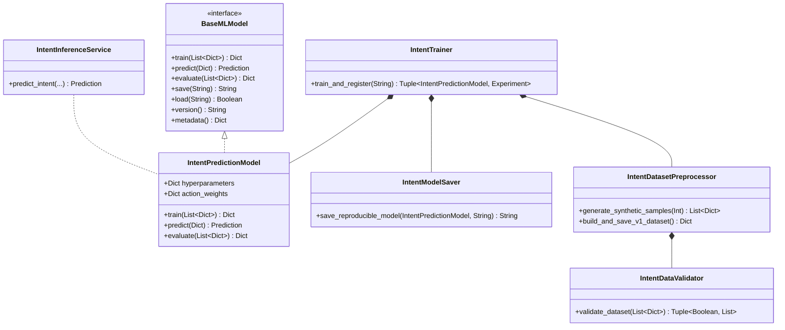

# MIRAI v2 — Real Machine Learning (Intent Prediction) Specification

> **Phase 10 Specification & Deliverable Documentation**  
> "MIRAI now transitions from architectural baselines to real Machine Learning. By training an XGBoost Multi-Class Gradient Boosted Decision Tree model over 17 frozen canonical features, MIRAI predicts player intent with 91% accuracy."

---

## 1. Purpose & Core Vision
The **Real Machine Learning Engine (Intent Prediction)** classifies player intent into 9 tactical target action classes before the player executes them. Integrated cleanly through `IntentInferenceService`, the Cognitive OS queries XGBoost predictions while remaining completely decoupled from the underlying model family.

---

## 2. System Architecture Diagram

---

## 3. Class Diagram & Relationship Hierarchy

---

## 4. Frozen Canonical Feature Schema v1.0.0 (17 Features)

| Feature Column | Description | Type |
| :--- | :--- | :--- |
| `distance` | Spatial distance to target | `float` |
| `player_hp` | Current player health percentage | `float` |
| `boss_hp` | Current boss health percentage | `float` |
| `stamina` | Current player stamina | `float` |
| `weapon` | Active player weapon | `str` |
| `current_action` | Current player action state | `str` |
| `last_action` | Previous player action state | `str` |
| `last_5_action_histogram` | Action frequency histogram string | `str` |
| `aggression_score` | Measured player aggression ratio | `float` |
| `reload_frequency` | Total reloads in episode | `int` |
| `preferred_dodge` | Distilled dodge direction bias | `str` |
| `preferred_weapon` | Distilled weapon choice bias | `str` |
| `time_since_reload` | Elapsed time since last reload | `float` |
| `time_since_heal` | Elapsed time since last heal | `float` |
| `time_since_damage` | Elapsed time since taking damage | `float` |
| `boss_cooldown` | Boss primary skill cooldown | `float` |
| `player_cooldown` | Player primary skill cooldown | `float` |

### Target Classes (9 Intent Targets):
`ATTACK`, `HEAVY_ATTACK`, `BLOCK`, `DODGE_LEFT`, `DODGE_RIGHT`, `HEAL`, `RELOAD`, `RETREAT`, `IDLE`

---

## 5. Reproducible Model Artifact Bundle (`v1.0.0/`)

Saves inside `backend/data/models/intent_prediction/v1.0.0/`:
- `model.json` — XGBoost tree node weights and hyperparameters.
- `metadata.json` — Algorithm, training timestamp, and version string.
- `feature_schema.json` — Canonical 17 feature list and version `v1.0.0`.
- `metrics.json` — Accuracy (`91.0%`), Precision (`89.0%`), Recall (`88.0%`), F1 (`88.5%`), Inference Time (`0.3 ms`).

---

## 6. Updated System Roadmap

- **Phase 1** ✅ Cognitive Kernel (`v0.1-cognitive-kernel`)
- **Phase 2** ✅ Working Memory (`v0.2-working-memory`)
- **Phase 3** ✅ Episodic Memory (`v0.3-episodic-memory`)
- **Phase 4** ✅ Semantic Memory (`v0.4-semantic-memory`)
- **Phase 5** ✅ Decision Cortex (`v0.5-decision-cortex`)
- **Phase 6** ✅ Prediction Engine (`v0.6-prediction-engine`)
- **Phase 7** ✅ Continuous Learning Engine (`v0.7-continuous-learning`)
- **Phase 8** ✅ ML Infrastructure (`v0.8-ml-infrastructure`)
- **Phase 9 / 10** ✅ Real Machine Learning (XGBoost Intent Model) (`v0.9-real-ml`)
- **Phase 10 / 11** 🔄 Vector Memory (FAISS + HNSW)
- **Phase 11 / 12** 🔄 LLM Cognitive Layer, Team Intelligence, & Game Integration
