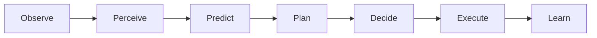

# MIRAI v2 — Runtime API Specification

## 1. Purpose
The **Runtime API** decouples internal Cognitive OS subsystems from external game engines (Unreal Engine 5, Unity, Godot, Pygame). It provides a 7-stage closed-loop pipeline executed via a single `tick()` function call.

---

## 2. 7-Stage Tick Pipeline



---

## 3. Class Structure

* **`MiraiRuntime`**: Core engine instance executing the 7-stage tick pipeline.
* **`RuntimeSession`**: Session wrapper providing lifecycle hooks.
* **`EventAPI`**: Game engine event bus listener (`PlayerMoved`, `PlayerAttacked`, `BossDamaged`).
* **`StateAPI`**: High-level decoupled state summary (`current_goal`, `current_plan`, `current_prediction`, `current_confidence`, `memory_summary`).

---

## 4. Code Example

```python
from backend.runtime.runtime import MiraiRuntime

runtime = MiraiRuntime()
runtime.emit_event("PlayerReloaded", {"player_id": "p1"})
action = runtime.tick({"timestamp": 10.0, "metadata": {"player_hp": 40.0}})
print(f"Action: {action}")
state = runtime.get_state_summary()
print(f"State Goal: {state['current_goal']}")
```
