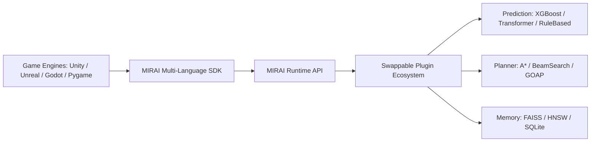
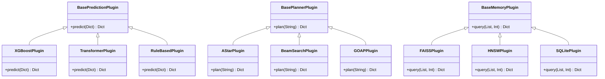

# MIRAI v2 — SDK & Plugin Ecosystem Specification

> **Phase 17 Specification & Deliverable Documentation**  
> "Reusable Framework & Plugin Architecture. Transforms MIRAI from a standalone project into a universal framework across Python, C#, C++, JavaScript, Unity, Unreal Engine 5, Godot, and Pygame."

---

## 1. Purpose & Core Vision
The **MIRAI SDK & Plugin Ecosystem** encapsulates the entire MIRAI Cognitive OS into a multi-language SDK (`python`, `csharp`, `cpp`, `javascript`) and a pluggable architecture. Game developers can swap Prediction, Planner, and Vector Memory backends without modifying internal Cognitive OS code.

---

## 2. System Architecture Diagram



---

## 3. Repository Structure

```text
mirai/
│
├── sdk/
│   ├── python/           # Python SDK (mirai_sdk.py)
│   ├── csharp/           # C# SDK (MiraiSdk.cs for Unity / .NET)
│   ├── cpp/              # C++ SDK (mirai_sdk.hpp for Unreal / Native)
│   └── javascript/       # JavaScript SDK (mirai_sdk.js for HTML5 / Node)
│
├── plugins/
│   ├── prediction/       # XGBoost, Transformer, RuleBased
│   ├── planner/          # A*, BeamSearch, GOAP
│   ├── memory/           # FAISS, HNSW, SQLite
│   ├── unity/            # Unity C# plugin package
│   ├── unreal/           # Unreal C++ plugin package
│   ├── godot/            # Godot GDScript plugin package
│   └── pygame/           # Pygame Python plugin controller
│
├── examples/             # Quickstart game engine examples
├── docs/                 # Architectural specifications
├── benchmarks/           # 1,000-match tournament benchmark suites
└── frontend/             # Real-time Web Visualization Dashboard
```

---

## 4. Multi-Language SDK Bindings

### 🐍 Python SDK (`sdk/python/mirai_sdk.py`)
```python
from sdk.python.mirai_sdk import MiraiSDK

sdk = MiraiSDK()
sdk.observe({"timestamp": 12.0, "metadata": {"player_hp": 80.0}})
action = sdk.tick()
sdk.learn({"outcome": "VICTORY"})
```

### ⚡ C# SDK (`sdk/csharp/MiraiSdk.cs` — Unity)
```csharp
using Mirai.SDK;

MiraiSDK sdk = new MiraiSDK();
sdk.Observe(gameState);
string action = sdk.Tick();
sdk.Learn(matchResult);
```

### 🏎️ C++ SDK (`sdk/cpp/mirai_sdk.hpp` — Unreal Engine 5)
```cpp
#include "mirai_sdk.hpp"

mirai::MiraiSDK sdk;
sdk.observe(gameState);
std::string action = sdk.tick();
sdk.learn(matchResult);
```

---

## 5. Swappable Plugin System



---

## 6. Complete 17-Phase System Roadmap

- **Phase 1** ✅ Cognitive Kernel (`v0.1-cognitive-kernel`)
- **Phase 2** ✅ Working Memory (`v0.2-working-memory`)
- **Phase 3** ✅ Episodic Memory (`v0.3-episodic-memory`)
- **Phase 4** ✅ Semantic Memory (`v0.4-semantic-memory`)
- **Phase 5** ✅ Decision Cortex (`v0.5-decision-cortex`)
- **Phase 6** ✅ Prediction Engine (`v0.6-prediction-engine`)
- **Phase 7** ✅ Continuous Learning Engine (`v0.7-continuous-learning`)
- **Phase 8** ✅ ML Infrastructure (`v0.8-ml-infrastructure`)
- **Phase 9 / 10** ✅ Real Machine Learning (XGBoost Intent Model) (`v0.9-real-ml`)
- **Phase 11** ✅ Temporal Intelligence (LSTM Sequence & Prediction Fusion) (`v1.0-temporal-intelligence`)
- **Phase 12** ✅ Vector Memory & Experience Retrieval (`v1.1-vector-memory`)
- **Phase 13** ✅ Strategic Planning System (`v1.2-strategic-planner`)
- **Phase 14** ✅ Simulation & Evaluation Framework (`v1.3-simulation-evaluation`)
- **Phase 15** ✅ Cognitive API & Runtime (`v1.4-cognitive-api-runtime`)
- **Phase 16** ✅ Developer Tools & Visualization Suite (`v1.5-developer-tools-visualization`)
- **Phase 17** ✅ MIRAI SDK & Plugin Ecosystem (`v2.0-mirai-sdk-ecosystem`)
