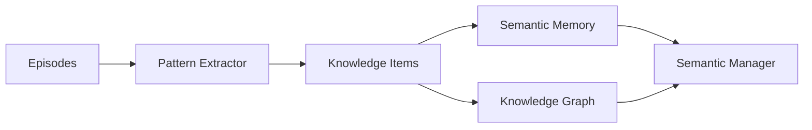
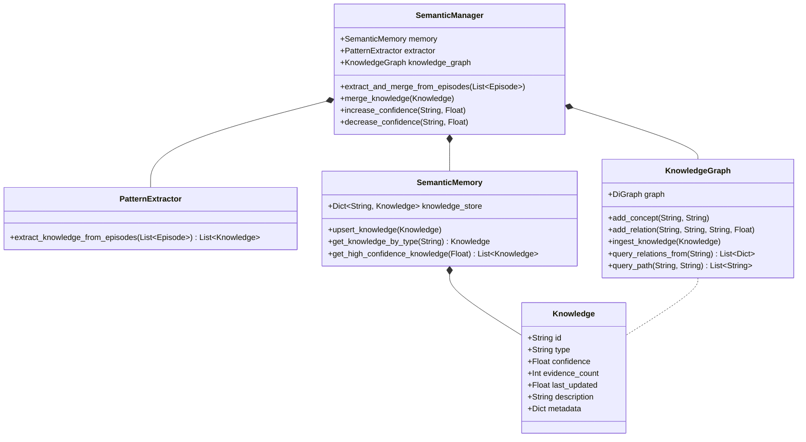

# MIRAI v2 — Semantic Memory (Knowledge Extraction Specification)

> **Phase 5 Specification & Deliverable Documentation**  
> "A human does not become intelligent by remembering every day of their life. They become intelligent by finding patterns across experiences. Semantic Memory stores distilled knowledge, not memories."

---

## 1. Purpose & Core Vision
While **Episodic Memory** answers *"What happened in Battle #12?"*, **Semantic Memory** answers *"What do all these battles tell me about this player?"*. Semantic Memory distills thousands of individual battle episodes into high-confidence statistical rules, habits, and relationship graphs (e.g. *"Player usually reloads after 3 attacks"*, *"Player prefers dodging Left"*).

---

## 2. System Architecture Diagram



---

## 3. Class Diagram & Relationship Hierarchy



---

## 4. Master Knowledge Object Schema

```json
{
  "id": "kn_reload_habit",
  "type": "PlayerReloadHabit",
  "confidence": 0.92,
  "evidence_count": 18,
  "last_updated": 1722000000.0,
  "description": "Player averages 15.0 reloads per battle",
  "metadata": {
    "avg_reloads_per_battle": 15.0
  }
}
```

---

## 5. Knowledge Graph Relationship Hierarchy

Semantic Memory utilizes NetworkX directed graphs to model complex cognitive relationship chains:

```text
Player --[USES]--> Shotgun --[USUALLY]--> Medium Range --[FREQUENTLY]--> Reload After 3 Attacks
```

---

## 6. Automatic Event Integration & Pipeline Flow

1. **Episode Saved Signal:** When `EpisodeManager` saves a new battle episode, an `EPISODE_SAVED` / `EPISODE_COMPLETED` event is emitted.
2. **Statistical Pattern Extraction:** `PatternExtractor` aggregates statistical distributions across historical episode summaries (dodge biases, reload frequencies, preferred weapons, engagement distances).
3. **Knowledge Distillation & Merging:** `SemanticManager` receives extracted `Knowledge` items, merges them with existing records, increments evidence counters, and strengthens confidence scores ($[0.0 \to 1.0]$).
4. **Graph Ingestion:** Distilled relationships are mapped into the `KnowledgeGraph`.
5. **Event Emission:** Emits `SEMANTIC_KNOWLEDGE_UPDATED` events to notify downstream cognitive modules (Prediction Engine).

---

## 7. Limitations & Future Expansion

- **Current Implementation:** Relies on statistical aggregations over episode summaries.
- **Future Expansion:** In later phases, `SemanticMemory` will feed probability matrices directly into **XGBoost Intent Classifiers** and **Utility AI Scoring Curves** to select proactive counter-strategies.
