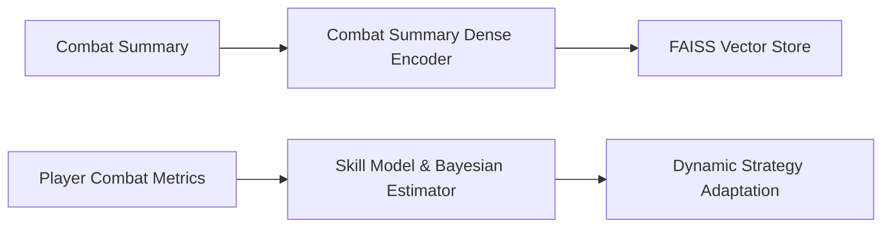
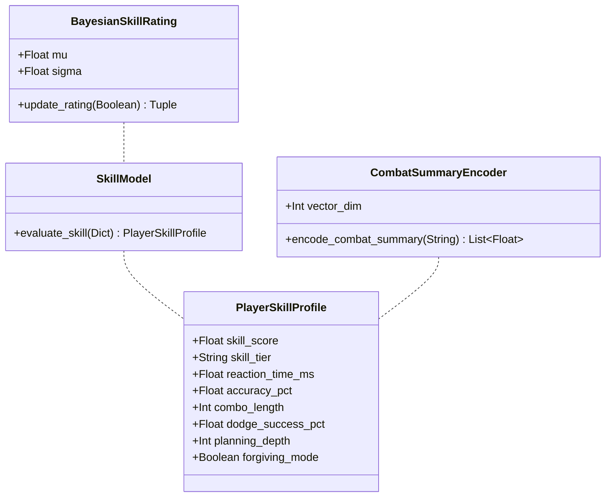

# MIRAI v2 — Skill Rating & Dense Memory Embeddings Specification

> **Phase 17 Steps 2 & 3 Specification & Deliverable Documentation**  
> "Continuous Player Skill Rating & Dense Semantic Combat Embeddings. Enables dynamic strategy adaptation (forgiving mode vs aggressive depth-5 planning) and dense behavior retrieval."

---

## 1. Purpose & Core Vision
The **Skill Rating Engine** continuously measures player ability ($0 \longrightarrow 100$) across 9 combat metrics. MIRAI dynamically adapts its tactical behavior: against Novices ($<30$), MIRAI switches to a forgiving mode with shallow planning (depth 2); against Professionals ($>90$), MIRAI engages aggressive counter-strategies with deep planning (depth 5). Coupled with **Dense Combat Summary Embeddings**, vector memory retrieves experiences based on similar combat behavior rather than simple numerical snapshot features.

---

## 2. System Architecture Diagram

---

## 3. Class Diagram & Component Hierarchy

---

## 4. Skill Score (0-100) & Strategy Adaptation Matrix

| Skill Score | Skill Tier | Strategy Adaptation | Planning Depth | Forgiving Mode |
| :--- | :--- | :--- | :--- | :--- |
| **< 30** | **Novice** | Forgiving combat, relaxed cooldowns | `Depth 2` | `True` |
| **30 - 59** | **Intermediate** | Standard utility AI combat | `Depth 3` | `False` |
| **60 - 79** | **Advanced** | Balanced tactical pressure | `Depth 4` | `False` |
| **80 - 89** | **Expert** | High aggression & pattern counter | `Depth 4` | `False` |
| **>= 90** | **Professional** | Aggressive, counter-heavy | `Depth 5` | `False` |

---

## 5. Dense Combat Summary Embedding Encoder

$$\text{Combat Summary Text} \longrightarrow \mathbf{\text{Dense Encoder (sentence-transformers)}} \longrightarrow \mathbf{\text{16-D / 384-D Dense Vector}} \longrightarrow \mathbf{\text{FAISS Spatial Index}}$$

---

## 6. Complete System Roadmap

- **Phase 1** ✅ Cognitive Kernel (`v0.1-cognitive-kernel`)
- **Phase 2** ✅ Working Memory (`v0.2-working-memory`)
- **Phase 3** ✅ Episodic Memory (`v0.3-episodic-memory`)
- **Phase 4** ✅ Semantic Memory (`v0.4-semantic-memory`)
- **Phase 5** ✅ Decision Cortex (`v0.5-decision-cortex`)
- **Phase 6** ✅ Prediction Engine (`v0.6-prediction-engine`)
- **Phase 7** ✅ Continuous Learning Engine (`v0.7-continuous-learning`)
- **Phase 8** ✅ ML Infrastructure (`v0.8-ml-infrastructure`)
- **Phase 9 / 10** ✅ Real Machine Learning (XGBoost Intent Model) (`v0.9-real-ml`)
- **Phase 11** ✅ Temporal Intelligence (LSTM Sequence & Prediction Fusion) (`v1.0-temporal-intelligence`)
- **Phase 12** ✅ Vector Memory & Experience Retrieval (`v1.1-vector-memory`)
- **Phase 13** ✅ Strategic Planning System (`v1.2-strategic-planner`)
- **Phase 14** ✅ Simulation & Evaluation Framework (`v1.3-simulation-evaluation`)
- **Phase 15** ✅ Cognitive API & Runtime (`v1.4-cognitive-api-runtime`)
- **Phase 16** ✅ Developer Tools & Visualization Suite (`v1.5-developer-tools-visualization`)
- **Phase 17.1** ✅ Threat Ranking Engine (`v2.1-threat-ranking`)
- **Phase 17.2 / 17.3** ✅ Skill Rating & Dense Memory Embeddings (`v2.2-skill-embeddings`)
