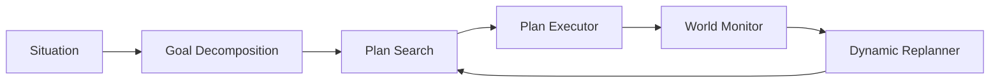
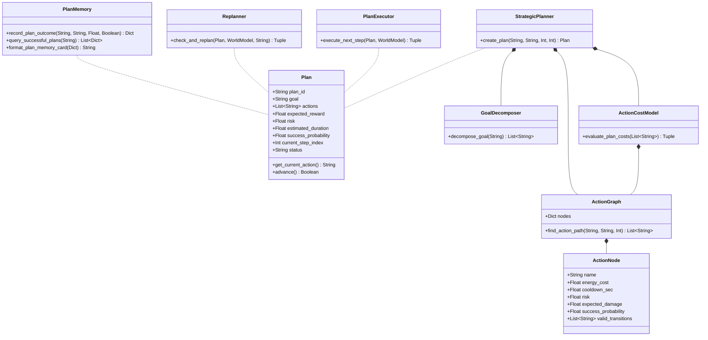

# MIRAI v2 — Strategic Planning System Specification

> **Phase 13 Specification & Deliverable Documentation**  
> "The single biggest leap in MIRAI. Instead of selecting single reactive moves, MIRAI formulates, evaluates, monitors, and dynamically replans multi-step combat strategies."

---

## 1. Purpose & Core Vision
The **Strategic Planning System** elevates MIRAI from a reactive decision-maker to a long-horizon strategic agent. The new cognitive loop transitions from single move selection to an adaptive closed loop:
$$\text{Situation} \longrightarrow \mathbf{\text{Goal}} \longrightarrow \mathbf{\text{Plan}} \longrightarrow \mathbf{\text{Execute}} \longrightarrow \mathbf{\text{Monitor}} \longrightarrow \mathbf{\text{Re-plan}}$$

---

## 2. System Architecture Diagram



---

## 3. Class Diagram & Component Hierarchy



---

## 4. Plan Memory Console Card Output

```text
==================================
Plan Memory Record
==================================
Plan #42
Against: Aggressive Sword Player
Success Rate: 94%
Average Damage: 83
==================================
```

---

## 5. Updated System Roadmap

- **Phase 1** ✅ Cognitive Kernel (`v0.1-cognitive-kernel`)
- **Phase 2** ✅ Working Memory (`v0.2-working-memory`)
- **Phase 3** ✅ Episodic Memory (`v0.3-episodic-memory`)
- **Phase 4** ✅ Semantic Memory (`v0.4-semantic-memory`)
- **Phase 5** ✅ Decision Cortex (`v0.5-decision-cortex`)
- **Phase 6** ✅ Prediction Engine (`v0.6-prediction-engine`)
- **Phase 7** ✅ Continuous Learning Engine (`v0.7-continuous-learning`)
- **Phase 8** ✅ ML Infrastructure (`v0.8-ml-infrastructure`)
- **Phase 9 / 10** ✅ Real Machine Learning (XGBoost Intent Model) (`v0.9-real-ml`)
- **Phase 11** ✅ Temporal Intelligence (LSTM Sequence & Prediction Fusion) (`v1.0-temporal-intelligence`)
- **Phase 12** ✅ Vector Memory & Experience Retrieval (`v1.1-vector-memory`)
- **Phase 13** ✅ Strategic Planning System (`v1.2-strategic-planner`)
- **Phase 14** 🔄 LLM Cognitive Layer & Full Game Integration
