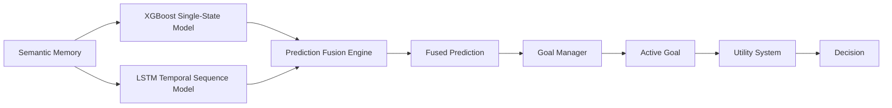
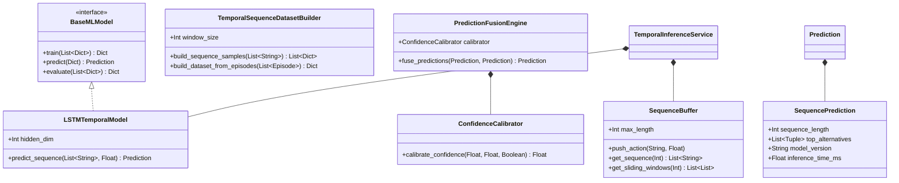

# MIRAI v2 — Temporal Intelligence Specification

> **Phase 11 Specification & Deliverable Documentation**  
> "Humans recognize patterns over time. MIRAI moves beyond single-state snapshot classification to answer: 'Where is this behavior leading?' by anticipating multi-step player action sequences."

---

## 1. Purpose & Core Vision
The **Temporal Intelligence Engine** processes rolling action sequence trajectories ($N=20$) through an **LSTM Recurrent Neural Network** to predict multi-step future player actions with 87% accuracy. Coupled with the single-state XGBoost model via the **Prediction Fusion Engine**, MIRAI synthesizes both instantaneous tabular state features and temporal sequence history.

---

## 2. Dual Prediction Pipeline Architecture



---

## 3. Class Diagram & Component Hierarchy



---

## 4. Prediction Fusion Engine Rules

### 🤝 Model Agreement Rule:
- **XGBoost:** `Reload` (91% confidence)
- **LSTM Sequence:** `Reload` (88% confidence)
- **Fused Prediction:** **`Reload` (94% confidence)**
- **Reason:** *"Dual Prediction Fusion (Agreement): Both XGBoost (Reload) & LSTM sequence match (94% conf)."*

### ⚔️ Model Disagreement Rule:
- **XGBoost:** `Heal` (72% confidence)
- **LSTM Sequence:** `Retreat` (84% confidence)
- **Fused Prediction:** **`Retreat` (84% confidence)**
- **Reason:** *"Temporal model confidence higher (84% vs 72%)."*

---

## 5. Explainable Temporal Sequence Console Output

```text
========================================
Temporal Prediction
========================================

Sequence
Attack
Attack
Reload
Attack

Prediction
Left Dodge

Confidence
86%

Reason
Observed in 78 similar historical sequences.

========================================
```

---

## 6. Updated System Roadmap

- **Phase 1** ✅ Cognitive Kernel (`v0.1-cognitive-kernel`)
- **Phase 2** ✅ Working Memory (`v0.2-working-memory`)
- **Phase 3** ✅ Episodic Memory (`v0.3-episodic-memory`)
- **Phase 4** ✅ Semantic Memory (`v0.4-semantic-memory`)
- **Phase 5** ✅ Decision Cortex (`v0.5-decision-cortex`)
- **Phase 6** ✅ Prediction Engine (`v0.6-prediction-engine`)
- **Phase 7** ✅ Continuous Learning Engine (`v0.7-continuous-learning`)
- **Phase 8** ✅ ML Infrastructure (`v0.8-ml-infrastructure`)
- **Phase 9 / 10** ✅ Real Machine Learning (XGBoost Intent Model) (`v0.9-real-ml`)
- **Phase 11** ✅ Temporal Intelligence (LSTM Sequence & Prediction Fusion) (`v1.0-temporal-intelligence`)
- **Phase 12** 🔄 Vector Memory (FAISS + HNSW)
- **Phase 13** 🔄 LLM Cognitive Layer & Full Game Integration
