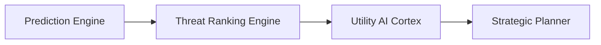

# MIRAI v2 — Threat Ranking Engine Specification

## 1. Purpose
The **Threat Ranking Engine** ranks candidate player intents into calibrated Threat Scores ($0.00 \longrightarrow 1.00$) across 17 input features.

---

## 2. Threat Ranking Architecture



---

## 3. 17 Canonical Input Features
1. `Player HP`
2. `Boss HP`
3. `Distance`
4. `Weapon`
5. `Ammo`
6. `Healing Items`
7. `Ultimate Charge`
8. `Movement Speed`
9. `Recent Aggression`
10. `Accuracy`
11. `Hit Streak`
12. `Reload State`
13. `Cooldowns`
14. `Current Goal`
15. `Prediction Confidence`
16. `Temporal Pattern`
17. `Baseline Risk Weight`

---

## 4. Code Example

```python
from backend.cognitive_os.threat.threat_ranker import ThreatRanker

ranker = ThreatRanker()
ranked = ranker.rank_threats(["Ultimate", "Healing", "Reload", "Retreat"])
for act, score in ranked:
    print(f"{act:<10}: {score:.2f}")
```
