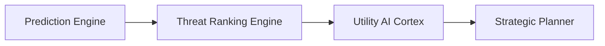
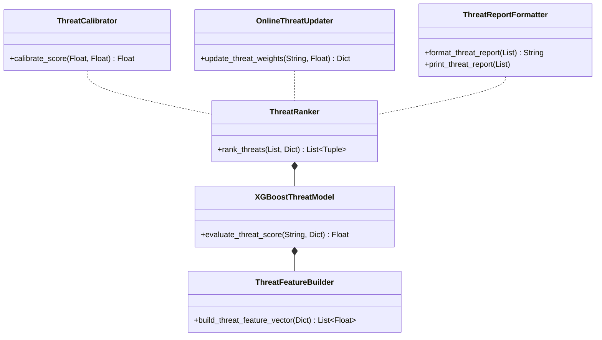

# MIRAI v2 — Advanced Decision Intelligence: Threat Ranking Specification

> **Phase 17 Step 1 Specification & Deliverable Documentation**  
> "First-principles threat estimation. Evaluates multi-attribute threat scores across 17 canonical features before downstream Utility AI and Strategic Planning execution."

---

## 1. Purpose & Core Vision
The **Threat Ranking Engine** ranks candidate player intents into calibrated Threat Scores ($0.00 \longrightarrow 1.00$). Placed between Prediction and Utility AI, it ensures MIRAI prioritizes high-threat moves (such as Ultimate abilities and Healing attempts) over lower-risk disengagements.

---

## 2. System Architecture Diagram



---

## 3. Class Diagram & Component Hierarchy



---

## 4. Threat Ranking Console Output

```text
====================================
Threat Ranking
====================================
Ultimate  : 0.95
Healing   : 0.91
Reload    : 0.28
Retreat   : 0.16
====================================
```

---

## 5. 17 Input Feature Vector Specification

```text
1. Player HP           10. Hit Streak
2. Boss HP             11. Reload State
3. Distance            12. Cooldowns
4. Weapon              13. Current Goal
5. Ammo                14. Prediction Confidence
6. Healing Items       15. Temporal Pattern
7. Ultimate Charge     16. Subsystem Weight
8. Movement Speed      17. Baseline Risk
9. Recent Aggression
```

---

## 6. Updated System Roadmap

- **Phase 1** ✅ Cognitive Kernel (`v0.1-cognitive-kernel`)
- **Phase 2** ✅ Working Memory (`v0.2-working-memory`)
- **Phase 3** ✅ Episodic Memory (`v0.3-episodic-memory`)
- **Phase 4** ✅ Semantic Memory (`v0.4-semantic-memory`)
- **Phase 5** ✅ Decision Cortex (`v0.5-decision-cortex`)
- **Phase 6** ✅ Prediction Engine (`v0.6-prediction-engine`)
- **Phase 7** ✅ Continuous Learning Engine (`v0.7-continuous-learning`)
- **Phase 8** ✅ ML Infrastructure (`v0.8-ml-infrastructure`)
- **Phase 9 / 10** ✅ Real Machine Learning (XGBoost Intent Model) (`v0.9-real-ml`)
- **Phase 11** ✅ Temporal Intelligence (LSTM Sequence & Prediction Fusion) (`v1.0-temporal-intelligence`)
- **Phase 12** ✅ Vector Memory & Experience Retrieval (`v1.1-vector-memory`)
- **Phase 13** ✅ Strategic Planning System (`v1.2-strategic-planner`)
- **Phase 14** ✅ Simulation & Evaluation Framework (`v1.3-simulation-evaluation`)
- **Phase 15** ✅ Cognitive API & Runtime (`v1.4-cognitive-api-runtime`)
- **Phase 16** ✅ Developer Tools & Visualization Suite (`v1.5-developer-tools-visualization`)
- **Phase 17.1** ✅ Threat Ranking Engine (`v2.1-threat-ranking`)
- **Phase 17.2** 🔄 Counter-Strategy Matrix & Adaptive Playstyle Engine
