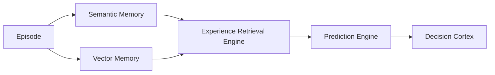
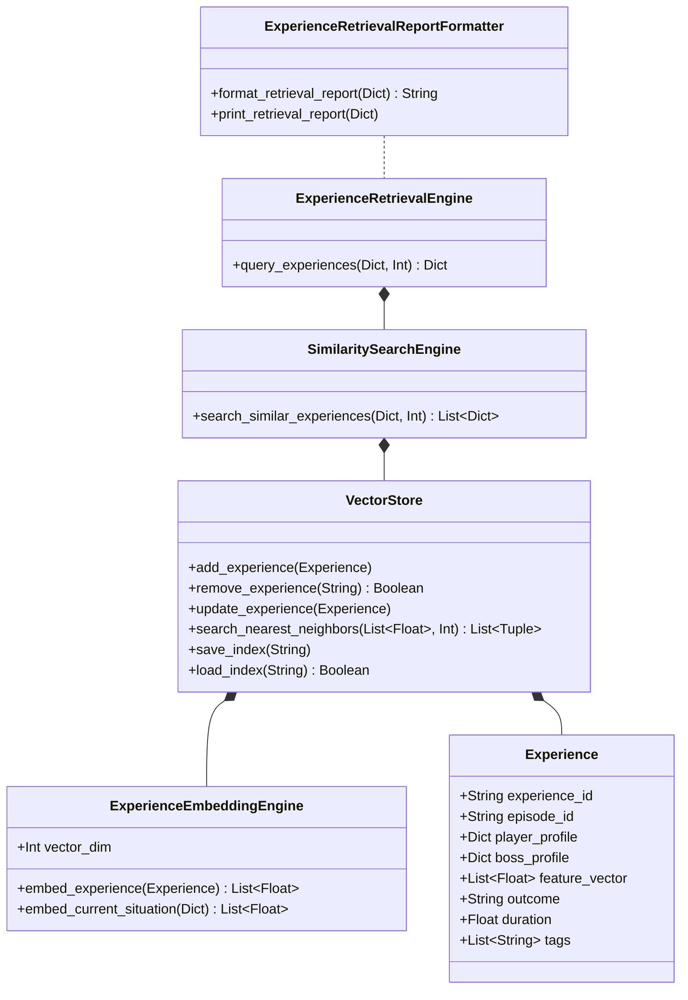

# MIRAI v2 — Vector Memory & Experience Retrieval Specification

> **Phase 12 Specification & Deliverable Documentation**  
> "Beyond distilled semantic facts, MIRAI retains specific past experiences. By embedding battle episodes into spatial vector memory, MIRAI answers: 'Have I seen something like this before?'"

---

## 1. Purpose & Core Vision
The **Vector Memory Engine** indexes complete battle experiences into normalized 16-dimensional embedding vectors. When MIRAI encounters a new battle situation, it retrieves Top-K similar historical combat memories via **Cosine Similarity Nearest Neighbor Search**, influencing prediction confidence and decision utilities without replacing rule-based safety contracts.

---

## 2. System Architecture Diagram



---

## 3. Class Diagram & Component Hierarchy



---

## 4. Experience Retrieval Console Report Output

```text
==================================
Experience Retrieval
==================================
Current Situation
Player HP: 34%
Boss HP: 48%

Top Matches
Episode 102
Similarity 0.94
Winner: Boss

Episode 58
Similarity 0.91
Winner: Player

Episode 17
Similarity 0.89
Winner: Boss

Recommended Strategy
Pressure Player

Confidence
93%
==================================
```

---

## 5. Updated System Roadmap

- **Phase 1** ✅ Cognitive Kernel (`v0.1-cognitive-kernel`)
- **Phase 2** ✅ Working Memory (`v0.2-working-memory`)
- **Phase 3** ✅ Episodic Memory (`v0.3-episodic-memory`)
- **Phase 4** ✅ Semantic Memory (`v0.4-semantic-memory`)
- **Phase 5** ✅ Decision Cortex (`v0.5-decision-cortex`)
- **Phase 6** ✅ Prediction Engine (`v0.6-prediction-engine`)
- **Phase 7** ✅ Continuous Learning Engine (`v0.7-continuous-learning`)
- **Phase 8** ✅ ML Infrastructure (`v0.8-ml-infrastructure`)
- **Phase 9 / 10** ✅ Real Machine Learning (XGBoost Intent Model) (`v0.9-real-ml`)
- **Phase 11** ✅ Temporal Intelligence (LSTM Sequence & Prediction Fusion) (`v1.0-temporal-intelligence`)
- **Phase 12** ✅ Vector Memory & Experience Retrieval (`v1.1-vector-memory`)
- **Phase 13** 🔄 LLM Cognitive Layer, Team Intelligence, & Full Game Integration
